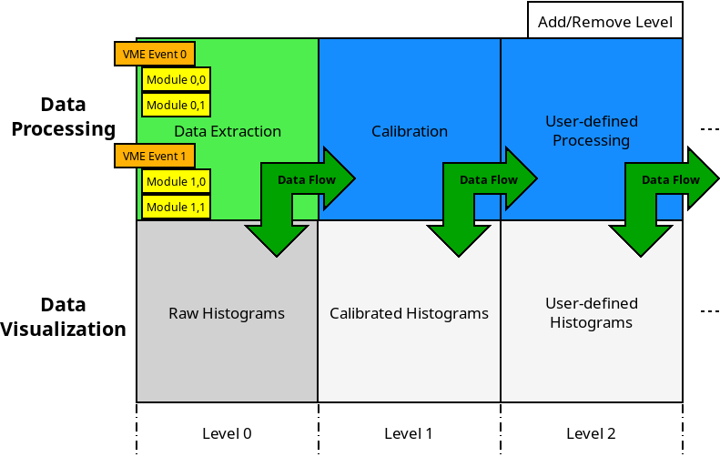
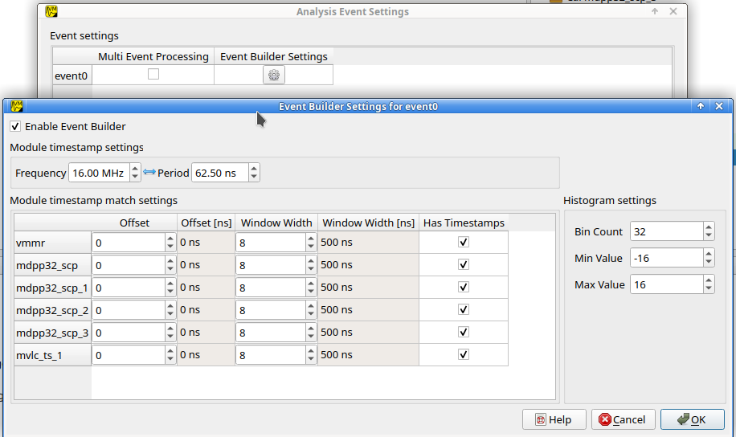

.. index:: Analysis

==================================================
Analysis
==================================================

.. _analysis-ui:
.. _analysis-user-guide:

User Guide
----------------------------------------

UI Overview
~~~~~~~~~~~

The Analysis system in mvme is designed to allow

* flexible parameter extraction from raw readout data.
* calibration and additional processing of extracted parameters.
* accumulation and visualization of processed data.

The user interface follows the structure of data flow in the system: the
*Events* and *Modules* defined in the VME configuration are shown in the
top-left tree.

The bottom-left tree contains the *raw histograms* used to accumulate the
unmodified data extracted from the modules.

The next column (*Level 1*) contains calibration operators in the top view and
calibrated histograms in the bottom view.

.. _analysis-ui-block-diagram:

    Analysis UI Block Diagram

.. note::
    To get a set of basic data extraction filters, calibration operators and
    histograms right-click on a module an select *Generate default filters*.

User Levels are used to structure the analysis and it's completely optional to have
more than two of them. Additional levels can be added/removed using the *+* and
*-* buttons at the top-right.  Use the *Level Visibility* button to select
which levels are shown/hidden.

The UI enforces the rule that operators can use inputs from levels less-than or
equal to their own level. This means data should always flow from left to
right. This restriction does not apply to data sinks in the bottom tree. These
can be freely placed on any userlevel in the bottom tree.

Operators can be moved between levels by dragging and dropping them.

.. _analysis-ui-screenshot:

.. figure:: images/analysis_ui_simple_io_highlights.png

    Analysis UI Screenshot

    The Calibration for *mdpp16.amplitude*  is selected. Its input is shown in
    green. Operators using the calibrated data are shown in a light blueish
    color.

Selecting an object will highlight its input data sources in green and any
operators using its output in blue.

Adding new objects
~~~~~~~~~~~~~~~~~~

Right-click in any of the views and select *New* to add new operators and
histograms. A dialog will pop up with input fields for operator specific
settings and buttons to select the operators inputs.

Clicking any of the input buttons will make the user interface enter "input
select mode". In this mode valid outputs for the selected input are
highlighted.

.. figure:: images/analysis_ui_add_op_input_select.png

    Input select mode

    Adding a :ref:`analysis-RangeFilter1D` to Level 2. Valid inputs are
    highlighted in green.

Click an input node to use it for the new operator. The *Parent Event*
specifies the event context in which the operator will be executed. The system
tries to pick the correct event based on the input selected. Manually setting
the parent event might be needed when doing cross-event analysis, e.g.
creating an operator which takes inputs from two unrelated events.

If required fill in any additional operator specific data and accept the
dialog. The operator will be added to the system and will immediately start
processing data if a DAQ run or replay is active.

For details about data extraction refer to :ref:`analysis-sources`.
Descriptions of available operators can be found in :ref:`analysis-operators`.
For details about 1D and 2D histograms check the :ref:`analysis-sinks` section.

.. _analysis-working-with-histos:

Working with histograms
~~~~~~~~~~~~~~~~~~~~~~~

1D and 2D histograms are shown in the bottom row of the user interface. Raw 1D
histograms are grouped by module in the bottom-left *L0 Raw Data Display* area.
Higher level data displays are grouped by histogram type.

New histograms can be added by right-clicking in one of the data display areas,
selecting *New* and choosing the histogram type.

.. _analysis-working-with-1d-histos:

1D
^^

1D histograms can take full arrays as input parameters. Internally an array of
histograms of the same size as the input array will be created.

Double-click on the *H1D* node to open the histogram array widget:

.. figure:: images/analysis_histo1d_listwidget.png

    1D Histogram Array Widget

* The histogram index can be changed using the spinbox in the top-right corner.

* Zooming is achieved by dragging a rectangle using the left mouse button. Zoom
  levels are stacked. Click the right mouse button to zoom out one level.

* Press the *Info* button to enable an info display at the bottom-right of the window.
  This will show the current cursor coordinates and the corresponding bin number.

* Y-Scale

  Toggle between linear and logarithmic scales for the Y-Axis.

* Gauss

  Fit a gauss curve through the currently visible maximum value.

* Rate Est.

  Rate Estimation feature.

  Refer to :ref:`howto-rate-estimation` for a how-to guide.

* Clear

  Clears the current histogram.

* Export

  Allows exporting to PDF and various image formats. Use the file type
  selection in the file dialog to choose the export format.

* Save

  Saves the histogram data to a flat text file.

* Subrange

  Allows limiting the range of data that's accumulated. Only input values
  falling within the specified interval will be accumulated.

  This does not affect the histogram resolution: the full range of bins is
  still used with the limits given by the subrange.

* Resolution

  Change the resolution of the histogram in powers of two from 1 bit to 20 bits.

  This will not rebin existing data. Instead the histogram is cleared
  and new data is accumulated using the newly set resolution.

.. _analysis-working-with-1d-histos-calibration:

* Calibration

  This button is enabled if the histograms input is a :ref:`Calibration
  Operator <analysis-Calibration>` and allows to directly modify the
  calibration information from within the histogram:

    .. autofigure:: images/analysis_histo1d_adjust_calibration.png

        Calibration adjustment from within the histogram display

  The two inputs in the *Actual* column refer to the current x-axis scale. The
  inputs in the *Target* column are used to specify the desired x-axis values.

  Click on one of the *Actual* inputs and then press the *Vis. Max* button to
  fill in the x-coordinate of the currently visible maximum value. Then enter the
  new x-coordinate value in the *Target* box and press *Apply*.

  In the example above it is known that the peak should be at ``x = 600.0``. The
  current x-coordinate of the peak was found using the *Vis. Max* button.
  Pressing *Apply* will modify the calibration for that particular histogram.

  To see a list of calibration values for each channel open the Analysis UI
  (``Ctrl+2``), right-click the :ref:`Calibration Operator
  <analysis-Calibration>` and select *Edit*.

* 2D combined view

  A combined view of the histograms of an array of parameters can be opened by
  right-clicking a **H1D** node and selecting *Open 2D Combined View*. This
  option will open a 2D histogram with one column per 1D histogram in the
  array.

  The X-axes of the 1D histograms are plotted on the combined views Y-axis, the
  values of the histograms are plotted in Z.

  This view allows to quickly see if any or all channels of a module are
  responding.

.. figure:: images/analysis_histo1d_combined_view.png

    2D Combined View of MDPP-16_SCP amplitude values

    Channels 0 and 8 are producing data with visible peaks at around 0 and 230.

.. _analysis-working-with-2d-histos:

2D
^^

2D histograms take two single values as their inputs: the X and Y parameters to
accumulate. When selecting the inputs you will need to expand other operators
and select the desired index directly.

.. figure:: images/analysis_ui_add_histo2d.png

    Adding a 2D Histogram

    Expand operator outputs and select individual indices for both axes.

Optional range limits can be specified for the axes. If enabled only values
falling within the given interval will be accumulated.

Double-click on a *H2D* node to open the histogram widget:

.. figure:: images/analysis_histo2d_widget.png

    2D Histogram Widget

* Zooming is achieved by dragging a rectangle using the left mouse button. Zoom
  levels are stacked. Click the right mouse button to zoom out one level.

* Press the *Info* button to show histo and cursor coordinate information at
  the bottom of the window.

* Z-Scale

  Toggle between linear and logarithmic scales for the Z-Axis.

* X- and Y-Proj

  Create the X/Y-Projection and open it in a new 1D histogram window. The
  projection will follow any zooming/scrolling done in the 2D histogram.

* Clear

  Clears the histogram.

* Export

  Allows exporting to PDF and various image formats. Use the file type
  selection in the file dialog to choose the export format.

* Subrange

  Allows limiting the range of data that's accumulated. Only input values
  falling within the specified interval will be accumulated.

  This does not affect the histogram resolution: the full range of bins is
  still used with the limits given by the subrange.

  Can optionally create a new histogram with the specified limits instead of
  modifying the current one. The newly created histogram will be added to the
  analysis.

* Resolution

  Change the resolution of the histograms axes in powers of two from 1 bit to 13 bits.

  This will not rebin existing data. Instead the histogram is cleared
  and new data is accumulated using the newly set resolution.

.. index:: Condition System
.. _analysis-condition-system:

Condition System
~~~~~~~~~~~~~~~~

Since mvme-1.5 the analysis system supports conditional evaluation/skipping of
operators and data sinks.

Conditions are a special kind of operator producing only a single output value:
the boolean result of evaluating the condition. Each condition can be applied
to multiple operators and/or data sinks. Multiple conditions can be applied to
the same object in which case the **logical AND** of all condition outputs is
used to decide whether the operator should be run.

Currently :ref:`1d-interval <analysis-interval-condition>`, :ref:`2d-polygon
<analysis-polygon-condition>` and boolean :ref:`expression conditions
<analysis-expression-condition>` are implemented.

Creating and editing conditions
^^^^^^^^^^^^^^^^^^^^^^^^^^^^^^^

:ref:`1d interval <analysis-interval-condition>` and :ref:`2d polygon
<analysis-polygon-condition>` conditions can be created and edited from within
histogram windows. Use the "Interval Conditions" or "Polygon Conditions" buttons
to start the respective editor.

A new condition created this way will use the same input arrays as the histogram
where the editor was started. The new condition will be placed in a common
directory on the same userlevel as the histogram used to create the condition.

.. figure:: images/analysis_polycond_editor.png

  Polygon Condition Editor

:ref:`Expression conditions <analysis-expression-condition>` are created the
same way as other operators: using the context menu and selecting ``New ->
Expression Condition``.

Using conditions
^^^^^^^^^^^^^^^^^^^

Once you have created one or more condtions you can apply them to operators and
(histogram) sinks using the right-click context menu and selecting "conditions".
This works the same way as the input selection when creating operators. If
multiple conditions are applied to the same operator they all have to evaluate
to **true** in the current event for the operator to be executed.

.. index:: Analysis Dependency Graph, Dependency Viewer
.. _analysis-dependency-graph:

Inspecting Dependencies
~~~~~~~~~~~~~~~~~~~~~~~

Since version 1.5 mvme includes a dependency graph viewer for analysis objects.
It allows to visualize the data path and any active conditions affecting the
processing. The graph can be opened from within histogram windows using the
``Dependency Graph`` button via the right-click context menu in the main
analysis window.

.. figure:: images/analysis_dependency_graph01.png

  Dependency graph for a 2D histogram. Active conditions in the data path are
  grouped together in the grey box.

Within the graph double-clicking on histograms or other sinks opens the
respective view, while double clicks on other objects start the appropriate
editor. Ctrl-clicking navigates to the graph for the clicked object.

System Details
----------------------------------------

As outlined in the :ref:`introduction <intro-analysis>` the analysis system is
a set of interconnected objects with data flowing from :ref:`Sources
<analysis-sources>` through :ref:`Operators <analysis-operators>` into
:ref:`Sinks <analysis-sinks>`.

The system is structured the same way as the VME Configuration: VME modules are
grouped into events. An event contains the modules that are read out on
activation of a certain trigger condition. The result of the readout is the
modules event data (basically an array of 32-bit words). This module event data
is the input to the analysis system.

When processing data from a live DAQ run or from a listfile replay the analysis
system is "stepped" in terms of events: in each step all the
:ref:`analysis-sources` attached to a module get passed the modules event data.
The task of each source is to extract relevant values from its input data and
make these values available to subsequent operators and sinks.

After all sources have processed the module event data, the dependent operators
and sinks are stepped in order. Each object consumes its input and generates
new output or in the case of sinks accumulates incoming data into a histogram.

.. figure:: images/analysis_flowchart.png

    Example analysis dataflow

.. _analysis-parameter-arrays:

Parameter Arrays
~~~~~~~~~~~~~~~~~~~~~~~~~~~~~~

The transport container carrying data between objects is the Parameter Array:

+-----------------+------------+-------+--------+
| **Parameter Array**                           |
+=================+============+=======+========+
| size            | unit label                  |
+-----------------+------------+-------+--------+
| **Parameters**                                |
+-----------------+------------+-------+--------+
| 0               | value      | valid | limits |
+-----------------+------------+-------+--------+
| 1               | value      | valid | limits |
+-----------------+------------+-------+--------+
| 2               | value      | valid | limits |
+-----------------+------------+-------+--------+
| \.\.\.          |            |       |        |
+-----------------+------------+-------+--------+
| *size-1*        | value      | valid | limits |
+-----------------+------------+-------+--------+

The *size* of parameter arrays is determined at analysis startup time and is
constant throughout the run. The *unit label* is a string which currently can
be set through the use of the :ref:`Calibration Operator
<analysis-Calibration>`. The index of a parameter in the array is usually the
channel address that was extracted from the modules data.

Each parameter has the following attributes:

* *value* (double)

  The parameters data value.

* *valid* (bool)

  True if the parameter is considered valid, false otherwise.

  A parameter can become invalid if for example a data source did not extract a
  value for the corresponding channel address or an operator wants to
  explicitly filter out the address or could not calculate a valid result for
  the input value.

* *limits* (two doubles)

  Two double values forming the interval ``[lowerLimit, upperLimit)`` that the
  parameters value should fall into. This is used by histogram sinks and
  calibration operators to determine the parameters range and thus calculate
  the binning.

Connection types
~~~~~~~~~~~~~~~~~~~~~~~~~~~~~~

Different operators have different requirements on their input types. The
:ref:`Calibration Operator <analysis-Calibration>` for example can use whole
parameter arrays as its input, transforms each data value and produces an
output array of the same size as the input size.

Other operators can only act on individual values and thus connect directly to
a specific *index* into the parameter array. An example is the :ref:`2D
Histogram Sink <analysis-histo2dsink>`: it requires exactly two input values, X
and Y, neither of which can be an array.

.. figure:: images/analysis_input_types.png

   Example of different input types

Each Operator implementation decides which types of input connections it
accepts. Some operators even change the type of inputs they accept based on the
first input type that is connected (they either accept full arrays for all
their inputs or single values for all their inputs).

The :ref:`Analysis UI <analysis-ui>` will highlight valid input nodes in green
when selecting an operators input.

.. _analysis-sources:

Data Sources
----------------------------------------
Analysis Data Sources attach directly to a VME module. On every step of the
analysis system they're handed all the data words produced by that module in
the corresponding readout cycle. Their job is to extract data values from the
raw module data and produce an output parameter array.

.. _analysis-extractor:

Filter Extractor
~~~~~~~~~~~~~~~~~~~~~~~~~~~~~~

The Filter Extractor uses a list of bit-level filters to classify input words
and extract address and data values.

.. _analysis-bit-level-filter-basics:

Filter Basics
^^^^^^^^^^^^^
A single filter consists of 32 characters used to match a 32-bit data word. The
filter describes the static parts of the data used for matching and the
variable parts used for data extraction. The first (leftmost) character of a
filter line matches bit 31, the last character bit 0.

The following characters are used in filter strings:

+-----------+---------------------+
| Character | Description         |
+===========+=====================+
| ``0``     | bit must be cleared |
+-----------+---------------------+
| ``1``     | bit must be set     |
+-----------+---------------------+
| ``A``     | address bit         |
+-----------+---------------------+
| ``D``     | data bit            |
+-----------+---------------------+
| others    | don't care          |
+-----------+---------------------+

The following conventions are used in the default filters that come with mvme:

* ``X`` is used if any bit value is allowed.
* ``O`` (the letter) is used to denote the position of the *overflow* bit.
* ``U`` is used to denote the position of the *underflow* bit.
* ``P`` is used to denote the position of the *pileup* bit.

These characters are merely used to make it easier to identify certain bits
when editing a filter. With regards to matching any character other than ``0``
or ``1`` means that any bit value is allowed.

.. highlight:: none

**Example**: The default *Amplitude* filter for the MDPP-16_SCP: ::

  0001 XXXX PO00 AAAA DDDD DDDD DDDD DDDD

The filter above contains a 4-bit address and a 16-bit data value. The
positions of the pileup and overflow bits are marked using ``P`` and ``O``.
This helps when adjusting the filter to e.g. match only pileup data (replace
the ``P`` with a ``1``).

The number of address bits (``A``) determine the size of the Filter Extractors
output array.

Data extraction from an input data word is done by keeping only the bits
matching the address or data mask and then right shifting to align with the 0
bit.

.. note::
   Address and data bit masks do not need to be consecutive. ``A0AA`` will
   produce 3-bit address values by gathering all extracted ``A`` bits on the
   right: ``0AAA``.

Each filter has an optional *word index* attached to it. If the word index is
set to a value >= 0, then the filter can only produce a match on the module
data word with the same index.

Multiple filter words
^^^^^^^^^^^^^^^^^^^^^

The Filter Extractor implementation allows combining multiple 32-bit filters to
match and extract data from multiple input words.

Filters are tried in order. If a previously unmatched filter produces a match
no further filters will be tried for the same data word.

Once all individual filters have been matched the whole combined filter matches
and address and data values can be extracted.

When extracting values the filters are again used in order: the first filter
produces the lowest bits of the combined result, the result of the next filter
is left-shifted by the amount of bits in the previous filter and so on.

.. note::
   The maximum number of bits that can be extracted for address and data values
   is limited to 64.

See :ref:`howto-rate-estimation-ts-extraction` for an example of how a
multiword filter can be used.

Matching and data extraction
^^^^^^^^^^^^^^^^^^^^^^^^^^^^

During a DAQ run or a replay the Filter Extractor gets passed all the data that
was produced by a single module readout (*Event Data*). Each data word is
passed to the internal filter.

Once the filter has completed *Required Completion Count* times, address and
data values will be extracted.

The data value is cast to a double and a uniform random value in the range
``[0, 1)`` is added. This resulting value is stored in the output parameter
array at the index specified by the extracted address value.

User Interface
^^^^^^^^^^^^^^
In the Analysis UI right-click a Module and select *New -> Filter Extractor* to
add a new filter.

.. figure:: images/analysis_add_filter_extractor.png

    Filter Extractor UI

Use the *+* and *-* symbols to add/remove filter words. The spinbox right of
the filter string lets you specify a word index for the corresponding filter.

*Required Completion Count* allows you to specify how many times the filter has
to match before it produces data. This completion count starts from 0 on every
module event and is incremented by one each time the complete filter matches.

If *Generate Histograms* is checked raw and calibrated histograms will be
created for the filter. *Unit Label*, *Unit Min* and *Unit Max* are parameters
for the :ref:`Calibration Operator <analysis-Calibration>`.

Predefined filters can be loaded into the UI using the *Load Filter Template*
button.

.. _analysis-multihit-extractor:

MultiHit Extractor
~~~~~~~~~~~~~~~~~~~~~~~~~~~~~~

The :ref:`Filter Extractors <analysis-extractor>` are limited to a single hit per extracted
(channel) address. If multiple hits per address can occur in the same event the MultiHit Extractor
can be used to gain access to these hits.

Properties
^^^^^^^^^^

* filter

  A single :ref:`bit-level filter <analysis-bit-level-filter-basics>` specifying the bit-pattern
  to match and the position and number of address and data bits.

* maxHits

  Maximum number of hits to record per address. The total number of hits will be counted in a
  separate *hitCounts* array.

* shape

  - Array per Hit

    Hit0 for all addresses is stored in the first array, hit1 in the second, etc.
    A total of ``maxHits`` arrays is created each of length :math:`2^{addrBits}`.

  - Array per Address

    Hits for the same address are recorded in an array of length ``maxHits``.
    Creates a total of :math:`2^{addrBits}` arrays.

Diagram showing the number and size of the MultiHit Extractor output arrays depending on the
selected shape type: ::

                 Array per Hit
               =================

           +----------------------+ <---.
     hit0  |                      |     |
           +----------------------+     |
           +----------------------+     |
     hit1  |                      |  maxHits
           +----------------------+  arrays
                     ...                |
           +----------------------+     |
     hitN  |                      |     |
           +----------------------+ <---'

           ^                      ^
           '----len=2^addrBits----'

           +----------------------+
 hitCounts |                      |
           +----------------------+

           ^                      ^
           '----len=2^addrBits----'

                 Array per Address
               =====================

           +----------------------+ <------.
   hits[0] |                      |        |
           +----------------------+        |
           +----------------------+        |
   hits[1] |                      |   2^addrBits
           +----------------------+     arrays
                     ...                   |
           +----------------------+        |
   hits[N] |                      |        |
           +----------------------+ <------'

           ^                      ^
           '------len=maxHits-----'

           +---------------------------+
 hitCounts |                           |
           +---------------------------+

           ^                           ^
           '------len=2^addrBits-------'

.. TODO: document the listfilter extractor

.. _analysis-operators:

Operators
----------------------------------------

The following operators are currently implemented in mvme:

.. _analysis-Calibration:

Calibration
~~~~~~~~~~~~~~~~~~~~~~~~~~~~~~

The calibration operator allows to add a unit label to a parameter array and to
calibrate input parameters using *unitMin* and *unitMax* values.

Each input parameters ``[lowerLimit, upperLimit)`` interval is mapped to the
outputs ``[unitMin, unitMax)`` interval.

.. figure:: images/analysis_op_Calibration.png

With *calibrate()*: ::

  Out = (In - lowerLimit) * (unitMax - unitMin) / (upperLimit - lowerLimit) + unitMin

Limits can be specified individually for each address in the input array. Use
the *Apply* button to set all addresses to the global min and max values.

.. figure:: images/analysis_calibration_ui.png

    Calibration UI

.. note::
    Calibration information can also be accessed from adjacent 1D histograms.
    Refer to :ref:`Working with 1D Histograms
    <analysis-working-with-1d-histos-calibration>` for details.

.. _analysis-PreviousValue:

Previous Value
~~~~~~~~~~~~~~~~~~~~~~~~~~~~~~

Outputs the input array from the previous event. Optionally outputs the last
input that was valid.

.. figure:: images/analysis_op_PreviousValue.png

.. figure:: images/analysis_op_PreviousValue_explanation.png

    Behaviour of Previous Value over time.

If *keepValid* is set the output will always contain the last valid input
values.

This operator can be combined with the :ref:`Difference Operator
<analysis-Difference>` to accumulate the changes of a parameter across events.
See :ref:`howto-rate-estimation` for an example.

.. _analysis-Difference:

Difference
~~~~~~~~~~~~~~~~~~~~~~~~~~~~~~

Produces the element-wise difference of its two inputs *A* and *B*:

.. figure:: images/analysis_op_Difference.png

The output unit label is taken from input *A*. If ``A[i]`` or ``B[i]`` are
invalid then ``Out[i]`` will be set to invalid: ::

    Out.Unit = A.Unit
    Out[i].lowerLimit = A[i].lowerLimit - B[i].upperLimit
    Out[i].upperLimit = A[i].upperLimit - B[i].lowerLimit
    Out[i].value      = A[i].value - B[i].value

.. _analysis-Sum:

Sum / Mean
~~~~~~~~~~~~~~~~~~~~~~~~~~~~~~

Calculates the sum (optionally the mean) of the elements of its input array.

This operator produces an output array of size 1.

.. figure:: images/analysis_op_Sum.png

When calculating the mean the number of *valid* input values is used as the denominator.

.. _analysis-ArrayMap:

Array Map
~~~~~~~~~~~~~~~~~~~~~~~~~~~~~~

Allows selecting and reordering arbitrary indices from a variable number of
input arrays.

.. figure:: images/analysis_op_ArrayMap.png

The mappings are created via the user interface:

.. figure:: images/analysis_array_map.png

    Array Map UI

* Use the *+* and *-* buttons to add/remove inputs. The elements of newly added
  inputs will show up in the left *Input* list.
* Select elements in the *Input* and *Output* lists and use the arrow buttons
  to move them from one side to the other.

Multiple items can be selected by control-clicking, ranges of items by
shift-clicking. Both methods can be combined to select ranges with holes
in-between them. Focus a list and press ``Ctrl-A`` to select all items.

.. _analysis-RangeFilter1D:

1D Range Filter
~~~~~~~~~~~~~~~~~~~~~~~~~~~~~~

.. figure:: images/analysis_op_RangeFilter1D.png

Keeps values if they fall inside (optionally outside) a given interval. Input
values that do not match the criteria are set to *invalid* in the output.

.. _analysis-RectFilter2D:

2D Rectangle Filter
~~~~~~~~~~~~~~~~~~~~~~~~~~~~~~

.. figure:: images/analysis_op_RectFilter2D.png

Produces a single *valid* output value if both inputs satisfy an interval based
condition.

.. _analysis-ConditionFilter:

Condition Filter
~~~~~~~~~~~~~~~~~~~~~~~~~~~~~~

.. figure:: images/analysis_op_ConditionFilter.png

Copies data input to output if the corresponding element of the condition input
is valid.

.. _exprtk: http://www.partow.net/programming/exprtk/index.html

.. _analysis-ExpressionOperator:

Expression Operator
~~~~~~~~~~~~~~~~~~~~~~~~~~~~~~

This operator uses the `exprtk`_ library to compile and evaluate C-like,
user-defined expressions.

The operator supports multiple inputs and outputs. The definition of the
outputs is done using an exprtk script, which means arbitrary calculations can
be performed to calculate the number of outputs, their sizes and their
parameter limits.

During analysis runtime a second script, the *step script*, is evaluted each
time event data is available. The script calculates and assigns parameter
values to the operators output arrays.

Details about the syntax and semantics are provided in the online help in the
Expression Operator user interface.

.. _analysis-ScalerOverflow:

ScalerOverflow
~~~~~~~~~~~~~~~~~~~~~~~~~~~~~~

The ScalerOverflow operator outputs a contiguous value given an input value
that overflows. This can be used to handle data like module timestamps which
wrap after a certain time.

.. _analysis-sinks:

Data Sinks
-----------------------------------------

mvme currently implements the following data sinks:

.. _analysis-histo1dsink:

1D Histogram
~~~~~~~~~~~~~~~~~~~~~~~~~~~~~~

Accumulates incoming data into 1D histograms. Accepts a full array or an
individual value as input. If given a full array the number of histograms that
will be created is equal to the array size.

See :ref:`Working with 1D histograms <analysis-working-with-1d-histos>` for usage details.

.. _analysis-histo2dsink:

2D Histogram
~~~~~~~~~~~~~~~~~~~~~~~~~~~~~~

Accumulates two incoming parameters into a 2D histogram. On each event input
data will only be accumulated if both the X- and Y inputs are *valid*.

See :ref:`Working with 2D histograms <analysis-working-with-2d-histos>` for details.

.. index:: Data Export, ExportSink, ROOT, ROOT export
.. _analysis-ExportSink:

Export Sink
~~~~~~~~~~~~~~~~~~~~~~~~~~~~~~

.. figure:: images/analysis_export_sink_ui.png

.. _ROOT: https://root.cern.ch/

Implements data export to binary files and C++/Python example code generation.

This operator does not create an exported version of all the readout data but
instead lets the user select a specific subset of analysis data arrays - all
belonging to modules in the same VME event - to be exported to a binary file on
disk.  Additionally skeleton code can be generated and used as a base for
reading in the generated file and working with the data.

For a complete, network-based readout data export including ROOT tree
generation see :ref:`EventServer <reference-event_server>`.

The Export Sink has a variable number of data input arrays that will be written
to disk. Additionally a single parameter condition input can be used to
pre-filter data: output data will only be generated if the condition input is
*valid*.

For each DAQ run or replay an export file named *data_<runid>.bin* is generated
and the data from each event is appended to that file. If zlib compression is
enabled the extension *.bin.gz* is used.

The inputs define the layout of the exported data (in the case of the
"Plain/Full" format the export file contains plain, packed C-structs).

Use the "C++ & Python Code" button to generate code examples showing how to
read and work with export data.

To compile the C++ code run ``cmake . && make`` inside the export directory.
The CMake file will try to find a `ROOT`_ installation using the environment
variable ``${ROOTSYS}`` and will search for **zlib** in the standard system
paths.

Most of the generated executables take an export binary file as their first
command line argument, e.g: ::

    ./root_generate_histos my_run_001.bin.gz

.. _analysis-RateMonitorSink:

Rate Monitor
~~~~~~~~~~~~~~~~~~~~~~~~~~~~~~

The rate monitor uses its input values as precalculated rates or calculates the
rate using the difference of successive input values. Rate values are kept in a
circular buffer and a plot of the rate over time can be displayed.

Details can be found in the Rate Monitor user interface.

.. index:: Analysis Conditions
.. _analysis-conditions:

Conditions
-----------------------------------------

.. index:: Interval Condition
.. _analysis-interval-condition:

Interval Condition (1D Gates)
~~~~~~~~~~~~~~~~~~~~~~~~~~~~~~
Accepts a parameter array as the single input value. Holds an interval for each
member of the input array.

When being evaluated the Interval Condition checks if each input parameter
value is inside its respective interval. The final condition result is the
**logical OR** over the individual interval checks.

Note: intervals are interpreted as half-open with the lower border
considered part of the interval.

.. index:: Polygon Condition
.. _analysis-polygon-condition:

Polygon Condition
~~~~~~~~~~~~~~~~~~~~~~~~~~~~~~
A two-dimensional condition checking if the input coordinates are contained
within a polygon.

.. index:: Expression Condition
.. _analysis-expression-condition:

Expression Condition
~~~~~~~~~~~~~~~~~~~~~~~~~~~~~~
Higher level condition, accepting multiple other conditions as its input. Uses
the `exprtk`_ library to evaluate a user-defined expression. The expression
result becomes the conditions output value.

.. index:: Analysis Processing Chain, Readout Data Processing
.. _analysis-processing-chain:

Readout Data Preprocessing
--------------------------

The standard data path into the analysis is straighforward: a readout parser
component interprets the data stream and produces reassembled module data
buffers which are then handed to the analysis system: ::

   raw readout data -> readout_parser -> analysis

Using the **Event Settings** dialog in the Analysis UI, the following additional
processing steps can be enabled.

.. index:: Multi Event, Multi Event Splitter, MultiEventSplitter
.. _analysis-multi-event-processing:

Multi Event Processing
~~~~~~~~~~~~~~~~~~~~~~

The purpose of Multi Event Processing module is to split multievent data
obtained from VME block reads into separate, individual events.

Multievent data can be read out from mesytec modules if ``multi event mode
(0x6036=0xb)`` is enabled and ``max transfer data (0x601A)`` is set to a value
greater than 1. With this setup each VME block read from the module will yield
up to the number of events specified in ``max transfer data`` provided the
module has enough events buffered up. This way of reading out modules can
dramatically improve performance as the modules can make full use of their
internal buffers and less individual VME transfers are used to read out the
same number of events. The drawbacks are that non-perfect trigger handling can
lead to unsynchronized events across modules and that data processing becomes
more complicated.

Splitting is performed on the module data as shown in the diagram below: ::

     multievent
    +-----------+                 split0           split1          split2
    | m0_event0 |              +------------+   +-----------+   +-----------+
    | m0_event1 |              |            |   |           |   |           |
    | m0_event2 |              | m0_event0  |   | m0_event1 |   | m0_event2 |
    |           | == split ==> | m1_event0  |   | m1_event1 |   | m1_event2 |
    | m1_event0 |              |            |   |           |   |           |
    | m1_event1 |              |            |   |           |   |           |
    | m1_event2 |              +------------+   +-----------+   +-----------+
    +-----------+

In the example the input multievent data obtained from a single event readout
cycle is split into three separate events.

Data splitting is performed by using analysis DataFilters to look for module
header words. If the filter contains the matching character ``S`` it is used to
extract the size in words of the following event. Otherwise each of the
following input data words is tried until the header filter matches again and
the data in-between the two header words is assumed to be the single event
data. ::

    +-----------+
    |m0_header  | <- Filter matches here. Extract event size if 'S' character in
    |m0_e0_word0|    filter, otherwise try the following words until another match is
    |m0_e0_word1|    found or there is no more input data left.
    |m0_e0_word2|
    |m0_header1 | <- Filter matches again
    |m0_e1_word0|
    |m0_e1_word1|
    |m0_e1_word2|
    +-----------+

When using mesytec modules the correct header filters for the modules are setup
by default and just enabling ``Multi Event Processing`` in the ``Event
settings`` dialog is enough to make the splitter system work. For non-mesytec
modules the header filter bitmask can be specified in the ``Module Settings``
dialog found in the context menu of each module in the analysis UI.

.. note::
   When using the MVLC VME Controller a info/debug system for the readout_parser
   and the multi_event_splitter is available via ``Debug & Stats -> Debug next
   buffer``.

.. index:: Event Builder, EventBuilder
.. _analysis-event-builder:

Event Builder
~~~~~~~~~~~~~

.. todo: improve the event builder description

Since version 1.4.7 mvme contains a timestamp based EventBuilder module which
can be enabled if using the MVLC VME Controller. The purpose of the
EventBuilder is to create optimally matched events across modules while
tolerating non-perfect trigger setups.

The system works by buffering up readout data from modules belonging to the
same event. Once a certain buffer threshold for the reference module (a user
chosen module that is guaranteed to have produced readout data for events we
are interested in) is reached the event building starts:

   For each module-event the module timestamp is extracted and compared to the
   timestamp of the reference module. A user defined time window specifies the
   maximum timestamp delta relative to the reference timestamp that is acceptable
   for the module-event to be included in the fully assembled output event.

.. raw:: latex

   \clearpage

Example: ::

         Buffered input events. (*) Marks the reference module.

             mod0          mod1(*)        mod2
          +--------+     +--------+    +--------+
          |  ev00  |     |  ev10  |    |  ev20  |
          |  ev01  |     |  ev11  |    |  ev21  |
          |  ev02  |     |  ev12  |    |  ev22  |
          |  ev03  |     |  ev13  |    |  ev23  |
          |        |     |  ev14  |    |  ev24  |
          +--------+     +--------+    +--------+

         A possible sequence of output events could look like this:

             mod0          mod1(*)        mod2
          +--------+     +--------+    +--------+
    out0  |  ev01  |     |  ev10  |    |  ev21  |
    out1  |  ev02  |     |  ev11  |    |  ev22  |
    out2  |  ev03  |     |  ev12  |    |  ev23  |
    out3  |  null  |     |  ev13  |    |  ev24  |
    out4  |  null  |     |  ev14  |    |  null  |
          +--------+     +--------+    +--------+

Given the above output ``ev00`` and ``ev20`` where outside the lower end of
their respective timestamp window, i.e. both events where too old to be
included in the output event ``out0``.

The following output events include data from all modules, until we run out of
buffered events for ``mod0`` and then ``mod2``. As we still do have main module
events to yield the missing modules will be set to null in the remaining output
events.

.. note::
   Timestamp extraction is currently hard-coded to work with the non-extended
   30 bit timestamps of mesytec modules.

   Event building is only implemented for the mesytec MVLC controller.

Event Building can be enabled in the ``Event Settings`` dialog. The reference
module, timestamp windows and minimum number of buffered events can set in
``Event Settings -> Event Builder Settings``. Changes are applied when
restarting the DAQ/replay.

    Event Builder Settings

More UI structuring and interactions
------------------------------------

Directories
~~~~~~~~~~~

Analysis *Directory* objects can be created in all but the first userlevels (L >
0). Directories are placed in either the top or bottom trees and keep that
assignment throughout their lifetime. Directories can contain any analysis
objects from the corresponding tree and other subdirectories.

Creating a new directory is done via **New -> Directory** in the context menu.

A directory can serve as the destination of a Drag and Drop operation. All
moved objects will be reparented to this destination directory.

Drag and Drop
~~~~~~~~~~~~~

Objects can be moved in-between trees by dragging and dropping. Selected
objects from the source tree will be moved to the destination tree. If the
destination is a directory all dropped objects will be reparented into that
directory.

Multiselections
~~~~~~~~~~~~~~~

By holding *Ctrl* and clicking analysis objects it is possible to create a
(cross-tree) multiselection. Combine holding *Ctrl* and *Shift* at the same
time to add ranges of objects to an existing selection.

.. note::
  Cross-tree multiselections do not apply to drag and drop operations as these
  start and end on specific trees. Thus using a cross-tree selection as the
  source of a drag operation would be counterintuitive.

Copy/Paste
~~~~~~~~~~

Object selections can be copied to clipboard by using *Ctrl-C* or choosing
*Copy* in a context menu.

Pasting is done via *Ctrl-V* or *Paste* in a trees or directories context menu.

If a selection containing internally connected objects is pasted the
connections will be restored on the newly created copies of the original
objects. This way a network of operators and sinks can be duplicated quickly as
only the "external" inputs will need to be reconnected on the copies.

If a directory has been copied the paste operation will create clones of the
directory and all of its subobjects.

Copy/paste of data sources is possible but newly pasted objects will not be
assigned to a specific module yet.

Import/Export
~~~~~~~~~~~~~

A way to share parts of an analysis is to **export** a cross-tree
multiselection to file and later on **import** from file. Use the *Export* and
*Import* toolbar entries in the analysis UI to perform these actions.

The behavior is similary to the copy/paste operations: all selected objects
will be exported to file. On import clones of these objects are created,
internal connections are restored and all objects are placed in the same
userlevels as their originals.

Loading foreign analysis files
~~~~~~~~~~~~~~~~~~~~~~~~~~~~~~

Internally VME modules are uniquely identified by a UUID and the module type
name. This information is stored in both the VME and analysis configs.

When opening (or importing from) a "foreign" analysis file, module UUIDs and
types may not match. In this case auto-assignment of analysis objects to VME
modules is tried first. If auto-assignment is not possible the unassigned
objects are collected under a special node in the top left tree of the analysis
window. Data sources from these unassigned modules can be dragged onto modules
existing in current DAQ setup to assign them.
