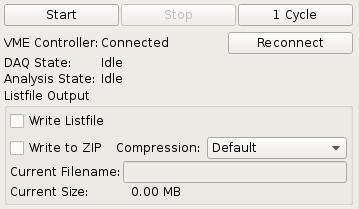

.. index:: DAQ Controls, DAQ, Replay

==================================================
DAQ / Replay controls
==================================================

    DAQ controls

The effects of the buttons depend on the current mode - DAQ or replay - and the
current state of the system:

.. table:: DAQ control actions
    :name: table-daq-control-actions

    +--------------+-----------------------------------+----------------------------------------+
    | Action       | DAQ mode                          | Replay mode                            |
    +==============+===================================+========================================+
    | Start        | * Run :ref:`vme-config-daq-start` | Start replay from beginning of file    |
    |              | * Open new listfile               |                                        |
    +--------------+-----------------------------------+----------------------------------------+
    | Stop         | * Run :ref:`vme-config-daq-stop`  | Stop and rewind to beginning of file   |
    |              | * Close listfile                  |                                        |
    +--------------+-----------------------------------+----------------------------------------+
    | Pause        | * Leave DAQ mode                  | Pause replay                           |
    |              | * No special procedures are run   |                                        |
    +--------------+-----------------------------------+----------------------------------------+

The **Start** button allows to choose what should happen with existing histogram
data. Selecting **Clear** will clear all histograms in the current analysis
before accumulating new data. Using **Keep** allows to accumulate the data from
multiple replays or DAQ runs into the same histograms.

The **Reconnect** button will attempt to reconnect to the current VME controller.

If **Write Listfile** is checked a new output listfile will be created when
starting a DAQ run. The file will be created in the **listfiles** subdirectory of
the current workspace. The filename is based off the current timestamp to make
it unique.

Use the **Compression** drop down to switch between a fast compression mode (ZIP
level 1) and no compression at all (ZIP level 0). Even without compression the
raw readout data is still placed in a ZIP archive together with the analysis
and log buffer contents.

Note: testing showed that higher compression levels did not yield a significant
increase in data reduction but had a high performance impact so the higher
level modes are not currently selectable via the GUI.

Use the **Run Settings** button to change settings regarding the naming scheme of
the listfiles produced during DAQ runs.

The **Workspace Settings** dialog allows setting the experiment name (used by the
'Event Server' component) and enabling/disabling the JSON-RPC and Event Server
components.

Replaying data from listfiles
-----------------------------

To replay data from a single listfile use **File -> Open listfile** and choose a *.zip*
or *.mvmelst* file.

When opening a listfile the VME config included inside the file is loaded and
will replace the current config. The global mode will be switched to
*Listfile*. To go back to DAQ mode use *File -> Close Listfile*.

There is also a dedicated 'Listfile Browser' window which can be opened via
``Window -> Listfile Browser (Ctrl+4)``. In addition to replaying from single
files the listfile browser allows to replay data from split listfiles (ending in
``partNNN.zip``). Make sure ``replay all parts`` is checked before opening the
first part of a split listfile, then start the replay normally. The partial
listfile archive currently being read is printed to the log window. To the
analysis it looks like the data stream is coming from a single file.
