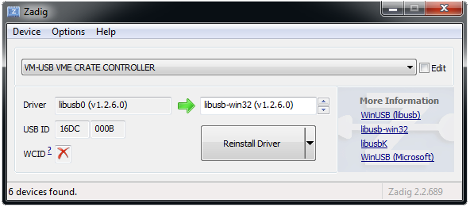

.. index:: Installation

Installation
##################################################

System Requirements
==================================================

* A recent 64-bit Linux distribution or a 64-bit version of Windows 7 or
  later.

* One of the supported VME Controllers:

  * `mesytec`_ MVLC (USB3/2, GBit/s Ethernet)
  * `WIENER`_ `VM-USB <http://www.wiener-d.com/sc/modules/vme--modules/vm-usb.html>`_ (USB2)
  * `Struck`_ SIS3153 (GBit/s Ethernet)

* At least 4 GB RAM is recommended.

* A multicore processor is recommended as mvme itself can make use of multiple
  cores: readout, data compression, analysis and the user interface all run in
  separate threads.

Mesytec MVLC
--------------------------------------------------

* Firmware updates for the MVLC can be found here:
  `<https://mesytec.com/downloads/firmware%20updates/MVLC/>`_

* When using the MVLC via USB the drivers for the FTDI USB Chip are usually
  shipped with the operating system. If your system does not recognize the
  device you can get the drivers from the FTDI website:
  `<https://www.ftdichip.com/Drivers/D3XX.htm>`_.

  Direct link to the driver installer:
  `<https://www.ftdichip.com/Drivers/D3XX/FTD3XXDriver_WHQLCertified_v1.3.0.4_Installer.exe.zip>`_

* Using the MVLC via Ethernet requires a GBit/s network connection.

WIENER VM-USB (Legacy)
--------------------------------------------------

* WIENER VM-USB VME Controller with a recent firmware

  The VM-USB firmware can be updated from within mvme. See
  :ref:`howto-vmusb-firmware-update` for a guide.

* Latest USB chipset driver for your system.

  Updating the driver is especially important for Windows versions prior to
  Windows 10 in combination with a NEC/Renesas chipset (frequently found in
  laptops). The driver shipped by Microsoft has a bug that prevents libusb from
  properly accessing devices. See the `libusb wiki`_ for more information.

* USB Driver: libusb-0.1 (Linux) / libusb-win32 (Windows)

  The windows installer can optionally run `Zadig`_ to handle the driver
  installation.

Struck SIS3153 (Legacy)
--------------------------------------------------

* The SIS3153 controller requires a GBit/s ethernet connection.

.. _mesytec: https://www.mesytec.com/
.. _WIENER: http://www.wiener-d.com/
.. _Struck: http://www.struck.de/

.. _libusb wiki: https://github.com/libusb/libusb/wiki/Windows

Installation Steps
==================================================

Linux
--------------------------------------------------

The mvme archives for Linux include all required libraries. The only
external dependency is the GNU C Library glibc. When using a modern Linux
distribution no glibc versioning errors should occur.

To install mvme unpack the archive and source the mvme env script which
will setup your ``PATH`` and ``LD_LIBRARY_PATH``::

    $ tar xf mvme-1.3.0-Linux-x64.tar.bz2
    $ source ./mvme-1.3.0-Linux-x64/bin/initMVME
    $ mvme

MVLC_USB and VM-USB Device Permissions
~~~~~~~~~~~~~~~~~~~~~~~~~~~~~~~~~~~~~~~~~~~~~~~~~

To be able to use the MVLC_USB or the VM-USB VME Controllers as a non-root user
a udev rule to adjust the device permissions needs to be added to the system.

For the MVLC a udev rules file is contained in the installation directory under
``extras/mvlc/51-ftd3xx.rules``. Copy this file to your udev rules directory
(usually ``/etc/udev/rules.d/``).

The rules file for the VMUSB can be found under
``extras/vm-usb/999-wiener-vm_usb.rules``.

After copying the file reload udev using ``service udev reload`` or
``/etc/init.d/udev reload`` or ``service systemd-udev reload`` depending on
your distribution or simply reboot the machine. The controller also has to be
reconnected to your PC for the device permissions to update.

Windows
--------------------------------------------------

Run the supplied installer and follow the on screen instructions to install
mvme.

.. _inst-windows-mvlc-ftdi-driver:

MVLC USB Driver
~~~~~~~~~~~~~~~~~~~~~~~~~~~~~~~~~~~~~~~~~~~~~~~~~

If Windows does not recognize the MVLC when plugged in via the front USB and
powered in a VME crate, your Windows installation might be missing the FTDI USB
driver. The driver installer can be found on the FTDI website:
`https://www.ftdichip.com/Drivers/D3XX/FTD3XXDriver_WHQLCertified_v1.3.0.4_Installer.exe.zip`_.

A non-installer version is also available on this page:
`https://www.ftdichip.com/Drivers/D3XX.htm`_.

.. _inst-windows-vmusb-driver:

VM-USB only: Driver Installation
~~~~~~~~~~~~~~~~~~~~~~~~~~~~~~~~~~~~~~~~~~~~~~~~~

To be able to use the VM-USB VME Controller the *libusb-win32* driver needs to
be installed and registered with the device. An easy way to install the driver
is to use the `Zadig USB Driver Installer <http://zadig.akeo.ie/>`_ which comes
bundled with mvme. You can run Zadig at the end of the installation process or
at a later time from the mvme installation directory.

In the Zadig UI the VM-USB will appear as *VM-USB VME CRATE CONTROLLER*. If it
does not show up there's either a hardware issue or another driver is already
registered to handle the VM-USB. Use *Options -> List All Devices* to get a
list of all USB devices and look for the controller again.

.. _installation-zadig:

   Zadig with VM-USB and libusb-win32 selected

Make sure *libusb-win32* is selected as the driver to install, then click on
*Install Driver*. `Zadig`_ will generate a self-signed certificate for the
driver and start the installation process.

It is highly recommended to restart your system after driver installation,
especially if you replaced an existing driver. Otherwise USB transfer errors
can occur during VME data acquisition!

In case you want to manually install the driver a ZIP archive can be found
here: `libusb-win32`_.

.. _Zadig: http://zadig.akeo.ie/

.. _libusb-win32: https://sourceforge.net/projects/libusb-win32/files/libusb-win32-releases/1.2.6.0/

Installation from source
--------------------------------------------------
The mvme sources are available on github: https://github.com/flueke/mvme

Refer to the README file for a list of required dependencies and build
instructions for Linux, Windows and Mac OS X.

Ethernet DHCP/ARP setup
==================================================
When using the MVLC via Ethernet or the SIS3153 controller some network setup
has to be done.

The easiest way to get a working setup is if you are running a DHCP server on
your network. Both of the controllers will request an IPv4-Address and a
hostname via DHCP after powerup.

The MVLC will request the hostname ``mvlc-NNNN`` where ``NNNN`` is the serial
number shown on the front-panel near the Ethernet port.

The SIS3153 requests a hostname of the form ``sis3153-0DDD`` where ``DDD`` is
the decimal serial number as printed on the board.

After the DHCP phase the two controllers should be reachable via their
hostnames. You can verify this by opening a command prompt and running

    ``ping mvlc-0010``

for the MVLC with serial number 10.

.. note::
    The lease time offered by your local DHCP server must be set to some value
    **longer than 1 hour**. Since firmware version FW0038 the MVLC will renew its
    lease every hour.

Using a manual ARP entry
--------------------------------------------------
.. TODO: add short description of the network layers below

In case DHCP with hostname assignment should not or cannot be used an
alternative approach is to manually associate the MAC-address of the controller
with an IP-address.

* Obtaining the controllers MAC-address

  The first step is to figure out the controllers MAC-address. This is the
  serial-number dependent Ethernet address of the controller.

  For the MVLC the MAC-address is ``04:85:46:d2:NN:NN`` where the ``NN:NN`` is
  the serial number of the MVLC in decimal. So for MVLC-0015 the full
  MAC-address is ``04:85:46:d2:00:15``.

  The MAC-address of the SIS3153 is ``00:00:56:15:3x:xx`` where ``x:xx`` is the
  serial number in hexadecimal. So for my development controller with S/N 42 the
  serial becomes ``0x2a`` and the resulting MAC-address is ``00:00:56:15:30:2a``.

With the MAC-address at hand we can now create an IPv4-address to MAC-address
mapping in the operating systems ARP table.

This step is specific to the operating system and will require root/admin
permissions. The below examples associate the IP-address ``192.168.100.42``
with the controllers MAC-address. You have to change the IP-address to match
your local network setup, otherwise the operating system does not know how to
reach the controller.

* Creating the ARP entry under linux:

  With root permissions an ARP entry can be addded this way:

    ``arp -s 192.168.100.42 04:85:46:d2:00:15``

  To make the entry permanent (at least on debian and ubuntu systems) the file
  /etc/ethers can be used. Add a line like this to the file:

    ``04:85:46:d2:00:15 192.168.100.42``

  This will take effect on the next reboot (or when restarting the networking
  services I think).

* Creating the ARP entry under windows:

  Open a ``cmd.exe`` prompt with **administrator** permissions and use the
  following command to create the ARP entry:

    ``arp -s 192.168.100.42 04-85-46-d2-00-15``

At this point mvme should be able to connect to the controller using the
IP-address specified above.

To further diagnose connection issues the following commands can be used to ping
the MVLC: ::

  echo -ne '\xF3\x00\x00\x00' | nc -uq0 192.168.100.42 32768
  ping 192.168.100.42

In the first line ``echo`` and ``netcat`` (``nc``) are used to send an empty but
valid command frame to the MVLC. This is required to make the MVLC leave the
DHCP phase and accept the supplied destination IP-address. The second command
attempts to ping the controller. If everything is setup correctly the ping
command should receive responses from the controller.

For the SIS3153 only the ping command is needed.

.. vim:ft=rst
