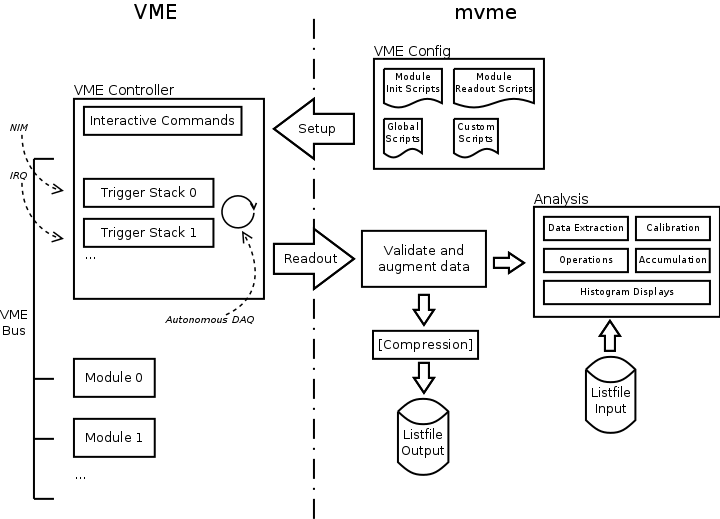
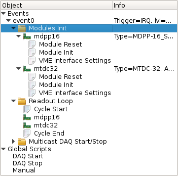
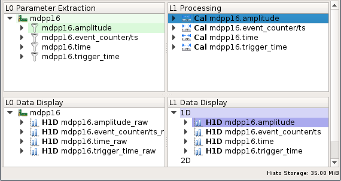

.. index:: Introduction

##################################################
Introduction
##################################################
**mvme** is a VME data acquisition solution by `mesytec`_ aimed at nuclear
physics experiments involving a single VME controller. The goal of this project
is to provide an easy to setup, easy to use, cross-platform data acquisition
system with basic data visualization and analysis capabilities.

.. _mesytec: https://www.mesytec.com/

   mvme overview

==================================================
Features
==================================================

* High-rate, low-latency VME module readout

* Supports the following VME Controllers:

  * **Mesytec MVLC**

    * USB3, USB2 and Ethernet connectivity
    * Lowest-latency readout, lowest deadtime
    * Flexible Trigger and I/O logic module
    * Possibility to use optical fiber based Ethernet via onboard SFP cage
    * GBit/s Ethernet connection required if using Ethernet!

  * **WIENER VM-USB** (USB2, readout rates of up to 15 MB/s)

  * **Struck SIS3153** (Ethernet)

     * Readout rates of up to 35 MB/s from a single module.
     * Optimized setups can yield around 52 MB/s.
     * GBit/s Ethernet connection required!

* Easy creation and configuration of the VME setup

  * Multiple event triggers are possible (NIM, IRQ, periodic readout)
  * Multiple modules can be read out per trigger
  * Flexible VME module setup using configuration scripts
  * Not limited to mesytec VME modules

* Live histogramming of readout data (1D and 2D)
* Rate Monitoring of internal system rates and external rates generated from
  readout data (e.g. scaler modules, event counters).
* Flexible VME module data extraction using matching and filtering on the bit level
* Graphical analysis UI
* Optional compression of output listfiles
* Replays of recorded listfile data
* JSON-RPC remote control interface over TCP

  Allows to remotely start and stop DAQ runs and request status information.

* Export of readout data to ROOT object trees.
* The analysis side is detached from the readout side. This means analysis
  complexity does not have a negative effect on readout performance. Instead
  during a live DAQ run the analysis side will only get as much data as it can
  process.

==================================================
High-level overview
==================================================

.. _intro-vme:

The VME side
--------------------------------------------------
mvme achieves high data rate, low-latency VME readout by using the VME
controllers **autonomous DAQ mode**. In this mode the controller executes lists
of commands (**trigger stacks**) upon activation of a specific trigger
condition. Data generated by the execution of trigger stacks is buffered and
then sent over USB or Ethernet to the controlling computer.

In mvme the physical VME setup is described as a tree of objects with
**events** as top-level nodes. Each event has a trigger condition (e.g.
*Interrupt* or *NIM*) and contains the **modules** to be read out on every
activation of the trigger.

A **module** in mvme has a collection of :ref:`VME Scripts
<vme-script-reference>`. These scripts contain the module configuration (module
specific parameters, multicast setup, etc.) and the commands required to
perform the readout. The readout commands of all modules belonging to the same
event are combined to form the trigger stacks uploaded to the VME controller.

   VME setup with one event containing two modules

The VME setup also describes the structure of the data that is expected to be
read out and thus allows the software to validate the received data stream.

For mesytec modules fully commented initialization files are bundled with mvme
and can be loaded as templates.

.. _intro-analysis:

Analysis
--------------------------------------------------
mvme contains an analysis system that allows parameter extraction (e.g. ADC
values per channel), calibration, accumulation and visualization of data both
during a DAQ run and while replaying from file. Additionally a set of built-in
operators can be used to perform calculations and transformations on the data
as it flows through the system.

   Analysis UI with MDPP-16 default objects

The structure defined by the VME configuration is also present in the analysis:
modules which are read out as a result of the same trigger condition are
grouped together in an event.

The system itself models dataflow from **sources**, through **operators**, into
**sinks**. Data is transported in the form of **parameter arrays** with each
element carrying the parameters numeric value and additional meta information.

.. figure:: images/analysis_flowchart.png

   Example analysis dataflow

**Sources** are data extractors that are directly attached to a VME module. A
source receives each data word that was read out from the module in response to
a trigger condition. Sources are used to split the data into logical parts, e.g
*Amplitude* and *Time* data and to extract the corresponding raw values.

**Operators** are logic pieces used to perform calculations on the data (e.g.
calibrate raw ADC values to voltage). Operators can have multiple inputs and
produce a single output array.

**Sinks** are data accumulators that do not produce any output parameters.
Currently 1D and 2D histograms, a rate monitor and a file exporter are
implemented.

Output parameters of sources and operators can be inspected at runtime.
Objects can be added, removed and modified even while the DAQ or a replay is
running. Changes are effective immediately.

.. _intro-daq:

The DAQ process
--------------------------------------------------
When requested to start a data acquisition run mvme performs the following
steps:

* Initialize the VME controller using information from the VME configuration
* Setup modules using the module VME scripts
* Switch the controller into autonomous DAQ mode
* Repeat until DAQ is stopped:

  * Read a data buffer from the VME controller
  * Validate the structure of the received data
  * Augment the data with mvme specific meta data
  * Write data to the listfile (optionally using compression)
  * Pass data to the :ref:`intro-analysis`

* Tell the controller to leave DAQ mode
* Close the listfile

.. note::
  Data acquisition and writing the data to file have the highest priority in
  mvme. If during a DAQ run the analysis system cannot keep up with the
  incoming data rate some buffers will not be passed on to the analysis.

  The fraction of *processed buffers / total buffers* is called the *analysis
  efficiency* and is shown in the bottom status bar of the analysis window.
  Hovering of the Efficiency number shows a tooltip with detailed buffer
  counts.

  When replaying from file *all* buffers are passed to the analysis.
