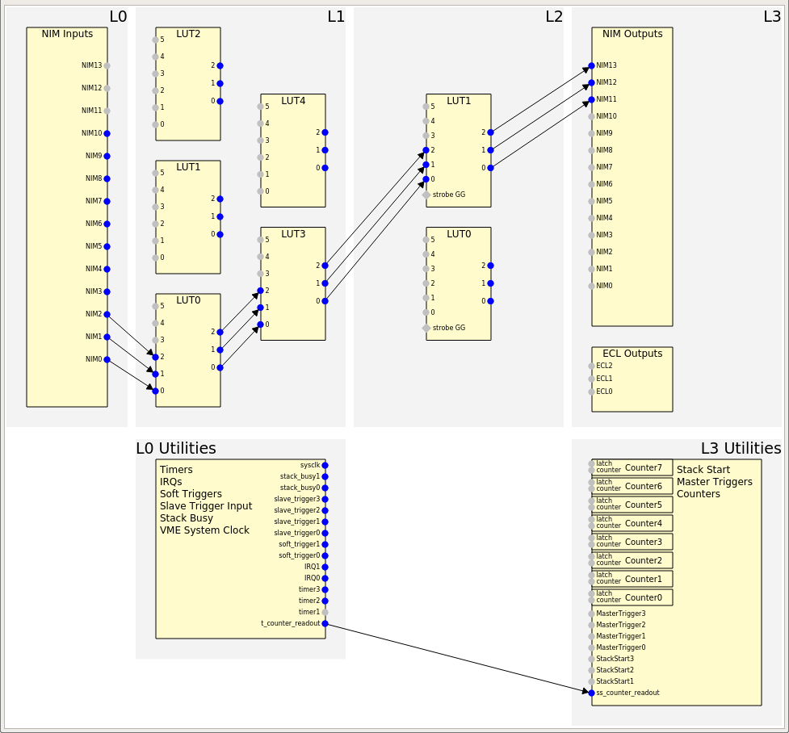
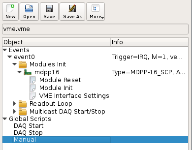
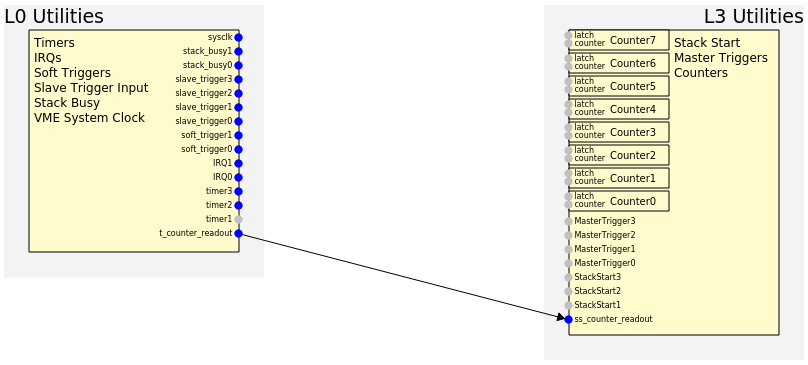
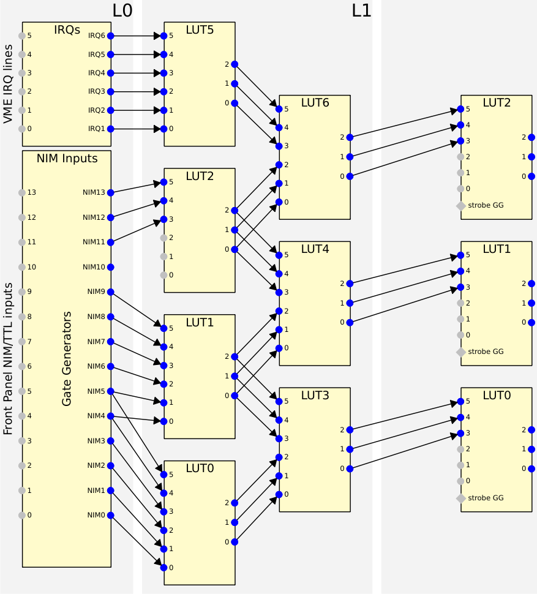
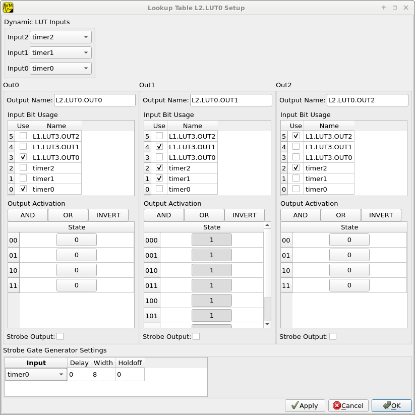
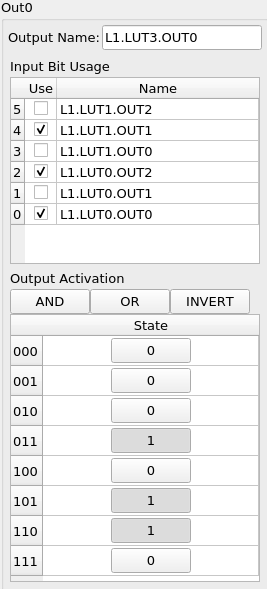
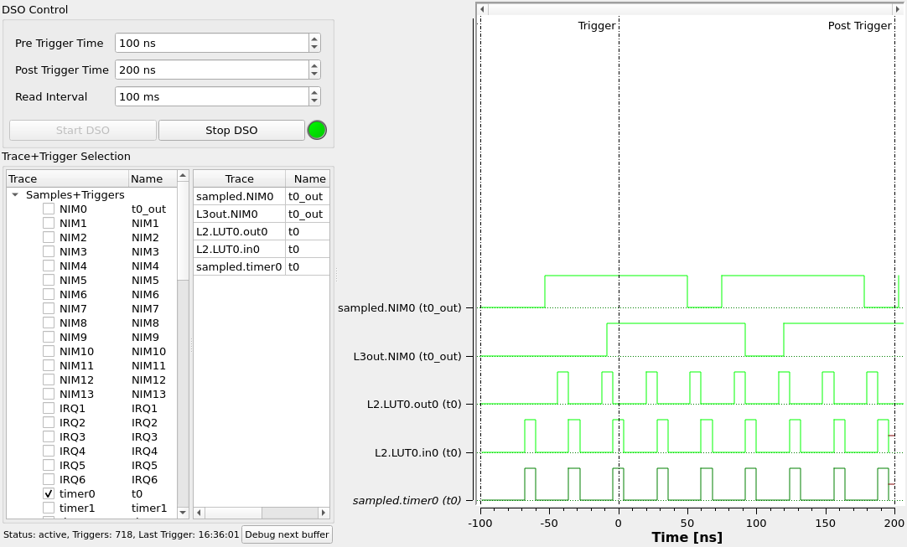

.. index:: MVLC Trigger/IO, mvlc_trigger_io
.. highlight:: none

.. _mvlc-trigger-io:

MVLC Trigger I/O Module
==================================================

Introduction
------------
The MVLC VME controller contains a digitial logic module enabling flexible
configuration of readout trigger logic and timings. The module includes setup
of the front-panel NIM IOs and ECL outputs, internal logic functions, signal
routing and access to utilities like timers, counters and the VME system clock.

The low-level setup of the Trigger I/O module is performed by writing to
special registers via MVLCs internal VME interface at base address
``0xffff0000``.  This means standard VME write commands can be used to setup
the module, create software triggers and read out counter values.

mvme contains a dedicated graphical interface representing the structure and
internal connections of the logic module. This interface shields the user from
the low-level details, allows to use custom signal names and simplifies
creating complex setups. The low-level VME commands used to setup the logic
module can still be viewed and manually edited if needed.

Structure and operation
-----------------------

   Structure of the MVLC Trigger I/O module

Logically the MVLC Trigger I/O module is divided into 4 levels with signals
originating on the lowest level and flowing through the system towards the
higher levels.

Each of the levels contains a set of specific units representing functionality
provided by the logic module. This includes the NIM I/Os, timers, lookup
tables, counters, access to command stacks etc.

The units from higher levels connect back to units from lower levels. Some of
these connections are hardwired while others can be dynamically selected from a
set of options.

Level 0 contains signal-generating units like NIM inputs, the VME system clock
and timers.

Levels 1 and 2 contain lookup tables which can be used to implement arbitrary
boolean logic and route signals to higher levels.

Level 3 consists of signal-consuming units like NIM outputs, counters and
units for executing command stacks.

The delay introduced by the logic module for a signal travelling from a NIM
input to a NIM output is ~160 ns.

User Interface and integration into mvme
----------------------------------------
Inside mvme the MVLC Trigger I/O module will appear as the topmost item in the
VME Config tree when one of the MVLC variants (USB or Ethernet) is selected as
the VME Controller.

   VME Config tree with the MVLC Trigger I/O module at the top

Double-clicking this module will open a dedicated GUI representing the current
configuration of the logic module. The view can be zoomed via the mouse wheel
and panned by holding down the left mouse button and moving the cursor.

Each of the blocks can be double-clicked to open an editor window specific to
the unit or groups of units. Input and output pins are represented by small
circles near the edges of each block. Connections between pins are drawn as
arrows from source to destination.

The user interface only draws arrows for connections it considers *active*.
NIM and ECL units have their own activation flags present in the hardware while
other units such as timers - which interally are always active - have a
software-only activation flag. Lookup table inputs are only considered active
if the corresponding input is actually used in the logic function implemented
by the LUT.

Each of the specific editor windows allows editing the names of input/output
pins which makes routing and connecting signals easier.

By default changes made in any of the editor windows are applied immediately
upon closing the editor or pressing the ``Apply`` button as long as mvme is
connected to an MVLC. This means the software representation of the Trigger I/O
module is converted to a list of VME write commands targeting the MVLC and then
this command list is directly executed. Use the ``Autorun`` button from the top
toolbar to toggle this behaviour.

If you want to view or edit the VME write commands directly use the ``View
Script`` button, make your changes inside the text editor that opens up and
then press the ``Reparse from script`` button to update the user interface.

Descriptions of the available units and their corresponding GUI editors can be
found in :ref:`mvlc_trigger_io_units`.

When starting a new DAQ run the initialization procedure will apply the current
logic setup to the MVLC before further initializing any modules and setting up
the readout stacks.

Reserved logic units
~~~~~~~~~~~~~~~~~~~~
To implement events that should be periodcally read out mvme reserves the first
two timer and stack start units. Currently these units are not available for
modification in the user interface.

Whenever a periodic event is created the first available timer unit is setup
with the events readout period. The first available StackStart unit is then
connected to the timer and setup to start the events readout command stack.

Note that if more than two periodic VME events are created, the rest of the
Timer and StackStart units will also be used by mvme. Having more than 4
periodic events defined in the VME config is not allowed and will lead to an
error at startup.

   Internal usage of Timer and StackStart units for a periodic VME event called
   ``counter_readout``.

.. _mvlc_trigger_io_gate_generators:

Gate Generators
---------------
Some of the Trigger I/O units have builtin gate generators to influence the
signals they produce. These units are the NIM I/Os, ECL outputs, VME IRQ inputs,
LUT strobe inputs and the SlaveTrigger inputs. The gate generators share a
common set of properties:

* Delay

  Delays generation of the output pulse by the specified time in nanoseconds.

  Minimum: 0 - no delay, maximum: 65535 ns

* Width

  The width of the generated pulse in nanoseconds. Setting the width to 0
  disables the gate generator.

  Minimum: 8 ns, maximum: 65535 ns.

* Holdoff

  Holdoff sets the minimum time that must elapse before the next change to the
  output may occur.

  Minimum: 0 ns, maximum: 65535 ns.

* Invert

  By default output pulses are generated at the leading edge of the input
  signal. Setting the invert flag changes this to the trailing edge.

Each gate generator can be disabled by setting its ``width`` to 0. In this case
the signal is passed through as is. This allows to make use of DC-level signals
inside the logic (for example busy inputs from external hardware).

.. _mvlc_trigger_io_units:

I/O and logic units
-------------------

.. index:: mvlc_trigger_io_NIM, NIM, TTL

NIM I/Os
~~~~~~~~
The front panel NIM connectors can be configured as either input or output.
This means they are available both on the level0 input side and on the level3
output side.

Each of the NIM I/Os is driven by a :ref:`gate generator
<mvlc_trigger_io_gate_generators>`. When a NIM is configured as an input the
gate generator is used to generate the *internal* signal. If the NIM is
configured as an output the gate generator affects the output signal of the
NIM.

Note that it is possible to use a NIM as both input and output at the same
time. In this case the NIM has to be configured as an output and the gate
generator acts on the output signal only.

.. index:: mvlc_trigger_io_LVDS, LVDS

LVDS outputs
~~~~~~~~~~~~
These are similar to the NIM output units. Each of the 3 outputs needs to be
activated separately.

.. index:: mvlc_trigger_io_IRQ, IRQ, VME IRQ, IRQ Input Units

IRQ inputs
~~~~~~~~~~
In addition to the front panel NIM inputs the Trigger I/O module also provides
access to VME IRQs 1-6. Each IRQ unit is connected to a :ref:`gate generator
<mvlc_trigger_io_gate_generators>` just like the NIM inputs. The output signal
of the gate generator is available for further processing in a LUT on level 1.

.. index:: mvlc_trigger_io_Timer, Timer
.. _mvlc-trigger-io-Timer:

Timers
~~~~~~
Fixed frequency logic pulse generation. The generated output pulses have a
fixed width of 8 ns. The minimum period between rising edges is 24 ns.

Settings
^^^^^^^^
* Range

  The time unit the timer period refers to. One of *ns*, *µs*, *ms* or *s*.

* Period

  The period in units specified by Range.

  Minimum: 24 ns, maximum: 65535 s.

* Delay

  Delays generation of the output pulse by the specified time in nanoseconds.

  Minimum: 0 - no delay, maximum: 65535 ns

.. index:: mvlc_trigger_io_TriggerResource, Trigger Resource

Trigger Resource Units
~~~~~~~~~~~~~~~~~~~~~~

Each TriggerResource can be configured as one of IRQ, SoftTrigger or SlaveTrigger unit types.

.. index:: mvlc_trigger_io_IRQ_util, IRQ, VME IRQ, IRQ Utility Units

IRQ Utility Units
^^^^^^^^^^^^^^^^^
These units generate a signal when one of the 7 available VME IRQs triggers.
The only setting is the IRQ number (1-7) each unit should react to.

.. index:: mvlc_trigger_io_SoftTrigger, Soft Trigger, SoftTrigger

Soft Triggers
^^^^^^^^^^^^^
Software triggers which can either be permanently activated via the GUI editor
or pulsed by executing one of the folowing VME Scripts:

Software triggers which can be pulsed or permanently activated via a VME write
instruction.

Example script:

::

   setbase 0xffff0000      # use the mvlc vme interface as the base address for the following writes

   set trigger_index 0                         # valid values: 0-7 (trigger_resource units)

   set trigger_unit $(4 + ${trigger_index})    # Level0 Units 4-11
   0x0200 ${trigger_unit}                      # select the unit
   0x0302 0                                    # write to the soft_trigger output activation register
                                               # 0: generate a 8ns pulse, 1: set the output to permanently high

The above script is available in mvme by right-clicking on the ``Manual``
directory in the VME Config Tree and choosing ``Add Script from Library -> MVLC
SoftTrigger``.

.. index:: mvlc_trigger_io_SlaveTrigger, Slave Trigger, SlaveTrigger

Slave Triggers
^^^^^^^^^^^^^^
Activates when one of the slave triggers fires. This feature will be available
in the future with a special multi-crate firmware and supporting software.

.. index:: mvlc_trigger_io_StackBusy, StackBusy

Stack Busy
~~~~~~~~~~
The stack busy units are active while their corresponding VME command stack is
being executed.

In the mvme user interface the command stack numbers are augmented with the
event names defined in the VME config.

.. index:: mvlc_trigger_io_Sysclk, Sysclk

Sysclk
~~~~~~
This unit provides access to the 16 MHz VMEbus system clock.

.. index:: mvlc_trigger_io_LUT, LUT, Lookup Table

Lookup Tables (Levels 1 and 2)
~~~~~~~~~~~~~~~~~~~~~~~~~~~~~~
The MVLC contains a set of lookup tables used to create logic functions and for
signal routing. Each lookup table (LUT) maps 6 input bits to 3 output bits.
This allows to e.g. implement 3 functions each mapping 6 input bits to one
output bit or a single 6 to 3 bit function.

Most of the LUT inputs are hardwired while some LUTs have up to three variable
inputs. Specifically level1.LUT2 can be connected to either NIM8-10 or IRQ1-3.

The LUTs on level2 connect back to the level1 LUTs and each has three variable
inputs which can be connected to the level1 utility units or certain level1 LUT
outputs. Additionally the level2 LUTs each have a strobe input which is used to
synchronize the switching of the LUT outputs.

   The lookup tables with all hardwired connections active.

LUT Editor GUI
^^^^^^^^^^^^^^
Editing of the LUT function is done via its own GUI:

   Editor window for a LUT on Level2.

Elements from top to bottom:

* Dynamic input selection for the first three inputs.

  This only appears for LUTs on Level2. The drop down boxes are populated with
  the possible choices for each of the dynamic inputs.

* Three columns of LUT functions, one for each of the three LUT output signals.

  Each LUT maps 6 input bits to 3 output bits. This means a total of
  :math:`2^{6}=64` input combinations per LUT. To make editing easier only the
  combinations for selected input bits are shown.

  Select the inputs you want to use via the checkboxes under ``Input Bit
  Usage``. This will populate the ``Output Activation`` table with the correct
  number of rows to represent each possible input combination.

  Each row of the ``Output Activation`` table represents the state of the
  output for the corresponding input combination. The input bit combination is
  shown on each row header with the lowest bit taking the rightmost place.
  Click the button to toggle the output state for the corresponding input
  combination.

  Using the ``AND``, ``OR`` and ``INVERT`` buttons allows to quickly populate
  the table with the corresponding function or invert the current assignment.

* For Level2 LUTs only: strobe input selection and parameters.

  For Level2 LUTs an additional ``Strobe Output`` checkbox is visible below the
  function table. If set the corresponding output bit will be affected by the
  LUTs strobe input.

  The strobe input signal can be selected from a predefined list and its
  :ref:`gate generator <mvlc_trigger_io_gate_generators>` parameters can be set
  using the controls in ``Strobe Gate Generator Settings``.

Note: mvme will attempt to minimize the boolean functions defined by each of
the LUTs. This means that not all selected input bits will necessarily be
selected again when next opening the editor window but the resulting function
should be identical.

Example
^^^^^^^

   Example LUT using input bits 0, 2 and 4. The output is activated if exactly
   two of the inputs are set.

.. _mvlc-trigger-io-StackStart:

.. index:: mvlc_trigger_io_StackStart, StackStart

StackStart
~~~~~~~~~~
These units start the execution of one of the 7 MVLC command stacks.

Settings
^^^^^^^^
* Index of the command stack to execute
* Delay: the delay in ns until the stack execution is started
* Activation flag

In the mvme user interface the command stack numbers are augmented with the
event names defined in the VME config.

.. index:: mvlc_trigger_io_MasterTrigger, MasterTrigger

MasterTrigger
~~~~~~~~~~~~~
Generates a master trigger in multi-crate setups. This feature will be
available in the future with a special multi-crate firmware and supporting
software.

.. index:: mvlc_trigger_io_Counter, Counter

Counters
~~~~~~~~
8 64-bit counter units incrementing by one each time the input rises. Each
counter has an optional latch input which atomically transfers the current
counter values to the counter registers. The latch can either be activated by
the Trigger/IO module or by writing to a special latch register.

The counter units can be read out via MVCLs internal VME interface at base
address ``0xffff0000`` using the following VME script:

::

   setbase 0xffff0000

   # counter0
   0x0200 0x0308           # counter select
   0x030a 1                # latch the counter (only needed if not done in the trigger_io module)
   read a32 d16 0x0300     # counter readout
   read a32 d16 0x0302
   read a32 d16 0x0304
   read a32 d16 0x0306

   # counter1
   /*
   0x0200 0x0309           # counter select
   0x030a 1                # latch the counter (only needed if not done in the trigger_io module)
   read a32 d16 0x0300     # counter readout
   read a32 d16 0x0302
   read a32 d16 0x0304
   read a32 d16 0x0306
   */

A dedicated VME module called ``MVLC Timestamp/Counter`` is provided by mvme to
ease setting up a counter readout. Add an instance of this module to the VME
Event where you want to read out the counter, edit the readout script (under
``Readout Loop`` in the user interface) and comment out all the counter blocks
except for the one that should be read out.

Digital Storage Oscilloscope
----------------------------
Since Firmware FW0018 the MVLC contains a digital storage oscilloscope (DSO)
allowing to acquire traces of the signals on the NIM, IRQ and Level1 utility
units. Additionally parts of the internal logic of the Trigger IO module are
simulated based on the sampled data.

   DSO user interface

The user interface for the oscilloscope can be accessed using the ``DSO``
button in the Trigger IO editor. The left side of the window is used for
controlling the DSO while the right side plots selected traces.

Steps needed to acquire traces
~~~~~~~~~~~~~~~~~~~~~~~~~~~~~~

1. Press the start DSO button to activate the DSO. No data will arrive yet as
   no triggers are active.

2. In the trace selection tree open the ``Samples+Triggers`` node and use the
   checkboxes to select at least one of the signals as triggers for the DSO.

3. Drag traces from the tree to the right side list to make them visible in
   the plot view.

4. Optionally adjust the pre- and post trigger times and the read interval
   using the inputs in the top left. These parameters can be adjusted while the
   DSO is active.

Notes
~~~~~

* The read interval is the software side polling interval. It implicitly
  affects the update frequency of the plot view. Setting the spinbox to the
  lowest value allows taking a single snapshot from the DSO by pressing the
  ``Start DSO`` button.

* The PreTrigger, PostTrigger and Trigger times are highlighted in the plot
  using vertical lines.

* Traces that are in the set of triggers are shown in *italics* in the plot
  view legend.

* Traces can be reordered via drag & drop in the trace list.

* Except for the traces under ``Samples+Triggers`` all other traces in the
  system are simulated based off the sampled data.

* The maximum number of samples per channel the MVLC can provide is limited.
  This means high frequency signals may be cut off and start after the
  PreTrigger time. The missing part of these traces is drawn using a red line
  signifying an *unknown* state. Simulation code also produces an *unknown*
  state if one of the inputs is *unknown*.

Trigger IO Usage Example: Sysclk timestamp readout
--------------------------------------------------

This example shows how to create a counter that increments with the VME system
clock frequency and to read out the counter values by creating a periodically
triggered readout event.

Only an MVLC is required for this setup to work.

* Start by creating new vme and analysis configs in mvme. Make sure the VME
  controller type is set to one of the MVLC variants and that mvme can
  succesfully establish the connection.

* In the VME Config tree right click the ``Events`` node and choose ``Add
  Event``. Select ``Periodic`` as the condition and accept the dialog.

  .. autofigure:: mvlc_examples/01-sysclk-readout/add_vme_event.png

  Creating the VME readout event

* Right-click the newly created event and select ``Add Module``. Use the type
  drop-down and select ``MVLC Timestamp/Counter``. Accept the dialog to create a
  module which will read out Counter0 of the Trigger I/O module.

  .. autofigure:: mvlc_examples/01-sysclk-readout/vme_tree.png

    VME Config Tree after creating the event and adding the mvlc timestamp module

* Locate the ``Multicast DAQ Start/Stop`` node under the newly created event
  and double-click the ``DAQ Start`` script it to open an editor window.

  Add the following line to the script.

  ::

      writeabs a32 d16 0xffff6090 1 # reset counters

  This will make sure the counters are reset when starting a DAQ run.

* Double-click the ``MVLC Trigger/IO`` object in the VME Config tree to open the
  graphical editor.

* Double-click the ``L3 Utilities`` block. In the bottom-left select the input
  for Counter0 and set it to ``sysclk``. Also check the ``Soft Activate``
  checkbox.

  .. autofigure:: mvlc_examples/01-sysclk-readout/l3_counter_setup.png

  Counter connected to sysclk and activated

* Now locate the ``Analysis UI`` window in mvme (Shortcut is *Ctrl-2*). event0
  should show up in the Event drop-down and the mvlc_ts module should be
  visible. In the top area right-click the mvlc_ts module and select ``Generate
  default filters``. Press ok to generate data extraction filters and
  histograms for the counter readout data.

* Use the Start button in the top-left area of the main window to start a DAQ
  run. If everything is setup correctly the DAQ should start successfully (*DAQ
  State: Running*) and an event rate of 1 count/s should be displayed in the
  Analysis window for the ``mvlc_ts.timestamp`` data source.

  .. autofigure:: mvlc_examples/01-sysclk-readout/daq_running.png

  DAQ and analysis stats during a run

* You can reopen the ``MVLC Trigger/IO`` object again and verify that mvme used
  the first timer together with the first StackStart unit to implement the
  periodic readout for the event.

  .. autofigure:: mvlc_examples/01-sysclk-readout/trigger_io_final_state.png

  Internal Timer and StackStart usage by mvme

.. Busy signals
.. ~~~~~~~~~~~~
..
.. 3 NIM inputs, each a busy signal from some hardware.
.. NIM GGs have to be disabled to let the DC-level busy signal through.
.. Use a level1 LUT, create the OR over the inputs and negate it. This is the 'not busy' signal
..
..
..
..
..
..
..
.. * NIM input to stack start/counter + counter readout
.. * Timer/sysclk to counter + counter readout
.. * Timer to stackstart for periodic events
.. * SoftTrigger to NIM output
.. * Some LUT setups
