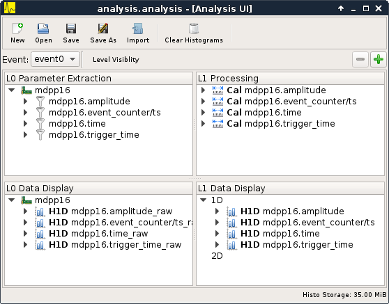

==================================================
Quickstart
==================================================

The quickstart guide explains how to create a simple setup using the **VM-USB**
VME controller and one **mesytec** VME module. The internal pulser is used to
generate test data. Data acquisition is triggered by the module using IRQ1.

.. FIXME
.. Additionally the modules event counter registers are read out periodically
.. using a second trigger.

.. note::
  In this example an MDPP-16 with the SCP firmware is used but any **mesytec**
  VME module should work. What might need to be adapted is the value of the
  pulser register (0x6070). Refer to the modules manual for details.

* Start **mvme** and create a new workspace directory using the file dialog
  that should open up. This directory will hold all configuration files,
  recorded listfiles, exported plots, etc.

* Three windows will open:

  * A main window containing DAQ and listfile controls, the VME configuration
    tree and a DAQ statistics area.

  * The analysis window. As there are no VME events and modules defined yet the
    window will be empty.

  * A log view where runtime messages will appear.

VME Setup
---------
* Select the **mvme** main window.

* Create a VME event:

  * Right-click the *Events* entry in the VME tree and select *Add Event*.

  * Select *Interrupt* in the *Condition* combobox. Keep the defaults of *IRQ
    Level = 1* and *IRQ Vector = 0*.

* Create a VME module:

  * Right-click the newly created event (called "event0" by default) and select
    *Add Module*.

  * Select *MDPP-16_SCP* from the module type list. If you changed the modules
    address encoders adjust the *Address* value accordingly (the address
    encoders modify the 4 most significant hex digits).

The VME GUI should now look like shown in :ref:`intro-vme-tree01`.

.. _intro-vme-tree01:

.. figure:: images/intro_vme_tree01.png
   :width: 8cm

   VME Config Tree

* Double-click the *Module Init* entry to open a VME Script Editor window.
  Scroll to the bottom of the editor window and adjust the register value for
  the modules internal pulser:

  ``0x6070 3``

* Click the *Apply* button on the editors toolbar to commit your changes to the
  VME configuration. Close the editor window.

* Start editing the *VME Interface Settings* VME Script. Near the top of the
  script set the *irq level* to 1:

  ``0x6010 1``

  This makes the module send IRQ 1 if it has data to be read in its internal
  buffer. The other parameters can be left at their default values. Click
  *Apply* and close the editor window.

Analysis Setup
--------------
* Activate the *Analysis UI* window (the shortcut is ``Ctrl+2``). The event
  containing the module just created should be visible in the UI.

* Right-click the module and select *Generate default filters*. Choose *Yes* in
  the messagebox that pops up. This will generate a set of data extraction
  filters, calibration operators and histograms for the module.

.. _intro-analysis-default-filters:

   MDPP-16 default filters

Starting the DAQ
----------------
Activate the main window again (``Ctrl+1``). Make sure the *VME Controller* is
shown as *Connected* in the top part of the window. Optionally uncheck the box
titled *Write Listfile* to avoid writing the test data to disk.

Press the *Start* button to start the DAQ. Check the *Log View* (``Ctrl+3``)
for warnings and errors.

In the *Analysis UI* double-click the histogram entry called *amplitude_raw*
(lower-left corner in the *L0 Data Display* tree) to open a histogram window.

If data acquisition and data extraction are working properly you should see new
data appear in the histogram. Use the spinbox at the top right to cycle through
the individual channels.

You can pause and/or stop the DAQ at any time using the corresponding buttons
at the top of the main window.

Troubleshooting
---------------
.. warning::
    TODO: Refer to a global troubleshooting section
