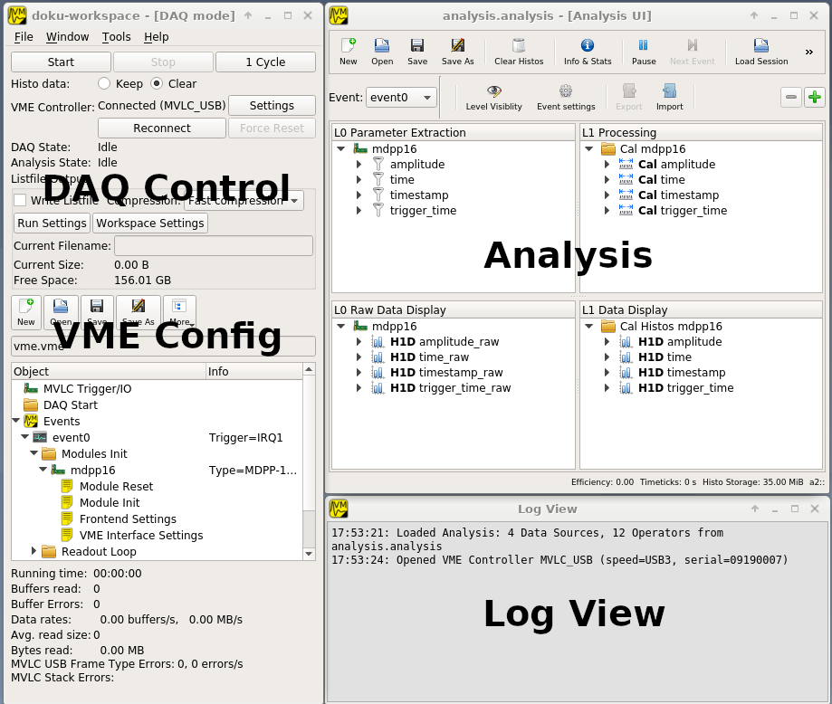
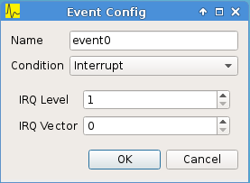
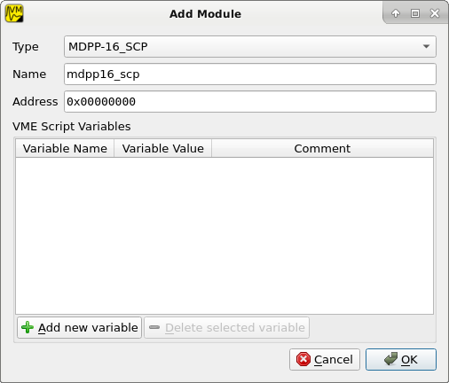
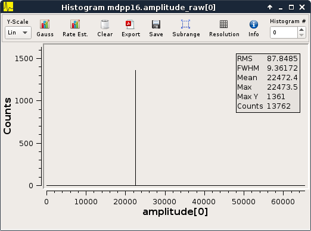

.. index:: Quickstart

.. _quickstart:

##################################################
Quickstart Guide
##################################################

The quickstart guide explains how to create a simple setup using the mesytec
MVLC VME controller and one mesytec VME module. The modules internal pulser is
used to generate test data. Data readout is triggered by the module itself
using IRQ1 on the VME bus.

.. note::
  In this example an MDPP-16 with the SCP firmware is used but any **mesytec**
  VME module should work. For other modules the value written to the pulser
  register (0x6070) might need to be adjusted. Refer to the modules manual and
  the VME templates for details.

* Start mvme and create a new workspace directory using the file dialog that
  should open up. This directory will hold all configuration files, recorded
  listfiles, exported plots, etc.

* Three windows will open:

  * A main window containing DAQ controls, the VME configuration tree and a
    statistics area.

  * The analysis window. As there are no VME events and modules defined yet the
    window will be empty.

  * A log view where runtime messages will appear.

    GUI overview

Press the ``Settings`` button in the DAQ Control area and select the correct
controller type (MVLC_USB in this example). Assuming the controller is
connected and powered on mvme will automatically find and use it. Also a
message containing information about the controller will appear in the Log
View.

==================================================
VME Setup
==================================================
* Select the mvme main window (*Ctrl+1*) containing the *VME Config* area.

* Create a VME event:

  * Right-click the *Events* entry in the VME tree and select *Add Event*.

  * Select *Interrupt* in the *Condition* combobox. Keep the default of *IRQ
    Level = 1*.

   Event Config Dialog

* Create a VME module:

  * Right-click the newly created event (called "event0" by default) and select
    *Add Module*.

  * Select *MDPP-16_SCP* from the module type list. If you changed the modules
    address encoders adjust the *Address* value accordingly (the address
    encoders modify the 4 most significant hex digits).

   Module Config Dialog

The VME Config should now look like similar to :ref:`quickstart-vme-tree01`.

.. _quickstart-vme-tree01:

.. figure:: images/intro_vme_tree01.png
   :scale-latex: 60%

   VME Config tree

* Double-click the *Module Init* entry to open a VME Script Editor window.
  Scroll to the bottom of the editor window or use the search bar to search for
  ``pulser`` and adjust the register value for
  the modules internal pulser:

  ``0x6070 1``

  This line tells mvme to write the value ``1`` to register address ``0x6070``.
  The address is relative to the module base address.

* Click the *Apply* button on the editors toolbar to commit your changes to the
  VME configuration. Close the editor window.

==================================================
Analysis Setup
==================================================
* Activate the *Analysis UI* window (the shortcut is ``Ctrl+2``). The event
  containing the module just created should be visible in the UI.

* Right-click the mdpp16 module and select *Generate default filters*. Choose
  *Yes* in the messagebox that pops up. This will generate a set of data
  extraction filters, calibration operators and histograms for the module.

.. _quickstart-analysis-default-filters:

.. figure:: images/intro_analysis_default_filters.png
   :width: 8cm

   Analysis UI with MDPP-16 default objects

==================================================
Starting the DAQ
==================================================
Activate the main window again (``Ctrl+1``). Make sure the *VME Controller* is
shown as *Connected* in the top part of the window.

.. _quickstart-daq-control:

.. figure:: images/intro_daq_control.png

   DAQ control

Optionally uncheck the box titled *Write Listfile* to avoid writing the test
data to disk. If left checked a listfile will be created for each newly started
DAQ run. This listfile is placed in the workspace directory under
``listfiles``. It is a standard ZIP archive containing the raw readout data and
copies of the current analysis setup and the log buffer contents.

The naming scheme of the listfiles can be adjusted via the ``Run Settings``
dialog. Note that mvme will never overwrite existing listfiles even if you
manually adjust the ``Next Run Number`` value.

Press the *Start* button to start the DAQ. Check the *Log View* (``Ctrl+3``)
for warnings and errors.

In the *Analysis UI* double-click the histogram entry called *amplitude_raw*
(bottom-left corner in the *L0 Data Display* tree) to open a histogram window.

If data acquisition and data extraction are working properly you should see new
data appear in the histogram. Use the spinbox at the top right to cycle through
the individual channels.

.. _quickstart-amplitude-histogram:

   Amplitude histogram

You can pause and/or stop the DAQ at any time using the corresponding buttons
at the top of the main window.

==================================================
Event Counter readout
==================================================

.. TODO: Expand on this. Explain what the counter values are, how to use them
.. TODO: in the analysis and how to convert them to counts/second.
.. TODO: On the other hand this is done in the rate setup tutorial. Maybe refer
.. TODO: to that.

Optionally a second event used to read out the modules event counter registers
can be created. This event will be triggered periodically by the VME controller.

* Right-click *Events*, choose *Add Event*
* Set *Condition* to *Periodic* and the period to ``1.0s``
* Right-click the newly created event, choose *Add Module*
* Select *MesytecCounter* as the module type
* Enter the same address as used for the MDPP-16 above

.. ==================================================
.. Troubleshooting
.. ==================================================
..
.. TODO: Refer to a global troubleshooting section

.. vim:ft=rst
