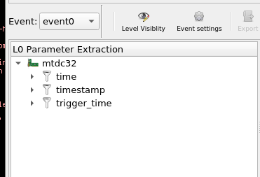
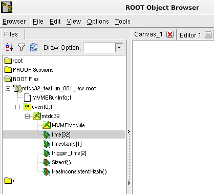

.. index:: Data Export, EventServer, ROOT, ROOT export
.. _reference-event_server:

EventServer for data export
===========================
Currently there are two ways built into mvme which allow readout data to be
accessed by external software:

* The :ref:`Analysis ExportSink <analysis-ExportSink>` which is described in
  the Analysis reference.

  This method should be used when a limited number of analysis data arrays -
  all belonging to modules in the same VME event - are to be exported.

* The **EventServer** component described in this section. It provides export
  functionality of the complete event data produced during a DAQ run. The data
  is transmitted over a TCP network connection.

  The EventServer should be used when you want to export all of the data
  produced by an experiment.

  The source code for a minimal example client and for a ROOT client is shipped
  with mvme.

Overview
---------------------------------------
The EventServer component is a TCP based network server built into mvme. It
uses a custom protocol to transmit extracted VME module data across the
network.

The "extracted" data is produced by the data filters attached to each of the
VME modules present in the experiment setup. E.g. with the default filters for
a MTDC-32 module the server will send 32 time values, 2 trigger_times and a module
timestamp.

   MTDC-32 with default data extraction filters.

The server is attached to the analysis side of mvme which means during a live
DAQ run it will not slow down the readout. Instead if the server, or the
attached clients, cannot keep up with the readout data rate then the normal
buffer loss mechanism at the core of the mvme DAQ will start to discard data.
This means during a live run clients may only see parts of the data, whereas
when replaying from a mvme listmode file all data will be transmitted.

The supplied ROOT client recreates the full *VME Event -> VME Module -> Data
Array* structure present in an mvme setup using automatically generated ROOT
classes. Additionally histograms of the raw parameter values are created and
written to a separate ROOT file.

   ROOT tree structure created from an MTDC-32.

.. note::
  The ROOT client requires ROOT6 and has so far only been tested on Linux.

.. note::
  An example mvme workspace which contains pre-recorded listmode data can be
  found on our website:
  https://mesytec.com/kundendaten/mvme-examples/mvme-example-workspace-01.tar.bz2

  This workspace can be used to test the server and client without needing to
  record your own data first.

Using the EventServer
---------------------------------------
* In the mvme main window go to ``Workspace Settings`` and check the ``Enable
  Event Server`` box. Optionally enter an IPv4 address or a hostname to bind
  the server to a specific network interface.

  Also enter an ``Experiment Name`` in the box at the top of the dialog. This
  will affect the filenames produced by the mvme_root_client.

* For a first test the *mvme_event_server_example_client* can be used. It can
  be found in the ``bin/`` directory of the mvme installation. Additionally the
  source code and a small Makefile are present in
  ``share/mvme_event_server_example_client``.

  Start the client on the same machine:
  ``./bin/mvme_event_server_example_client --print-data``.

  The client should be able to connect to the server running on localhost.

* Open an example listfile via ``File -> Open Listfile`` and also load the
  analysis from the file so that some data extraction filters are present.

* Start the replay. The client prints the incoming data to stdout.

If you want to write your own client you can find the protocol definition and
implementation of the base ``Client`` class in
``${MVME}/include/mvme/event_server/common``.

Using the ROOT client
---------------------------------------
The ROOT client is not shipped in binary form but has to be compiled manually
so that it links against the locally installed version of ROOT.

To build the client run the following shell commands:

   ::

      # cd into the mvme installation directory
      cd mvme
      # setup the enviroment ($PATH, $LD_LIBRARY_PATH)
      source bin/initMVME
      # compile and install the client
      make -C ${MVME}/share/mvme_root_client install

You can now create a data directory to hold the generated code and output ROOT
files and start the mvme_root_client from within this directory.

The mvme_root_client works in two modes:

1) In client mode it connects to an mvme instance and receives incoming readout
   data to produce ROOT output files.
2) The program replays data from a previously created ROOT output file.

In the first case the data description sent by mvme at the beginning of a
run is used to generate ROOT classes. These classes are then compiled and
loaded into the client. Compilation is done using a simple Makefile. The
resulting ROOT library is then loaded via TSystem::Load().

During the run incoming event data is interpreted and used to fill instances
of the generated ROOT classes. At the end of the run the class hierarchy is
written to file in the form of TTrees. Additionally raw histograms are
created, filled and written to a separate output file.

In the 2nd case the given input file is opened and mvme specific information
is used to locate the previously built ROOT object library. The library is
then loaded like in case 1) and the ROOT objects are filled from the data in
the input file.

In both cases user-editable analysis code (``analysis.cxx``) is loaded (via
dlopen()/dlsym()) and is invoked for each complete event received from mvme or
read from the input file. For each defined VME event the client will attempt to
call a function called ``analyze_<eventname>()``, e.g. ``analyze_event0()``.

For details on what the generated classes contain see the
``<ExperimentName>_mvme.{h,cxx}`` files. The base classes are defined in
``${MVME}/share/mvme_root_client/mvme_root_event_objects.{h,cxx}``.
