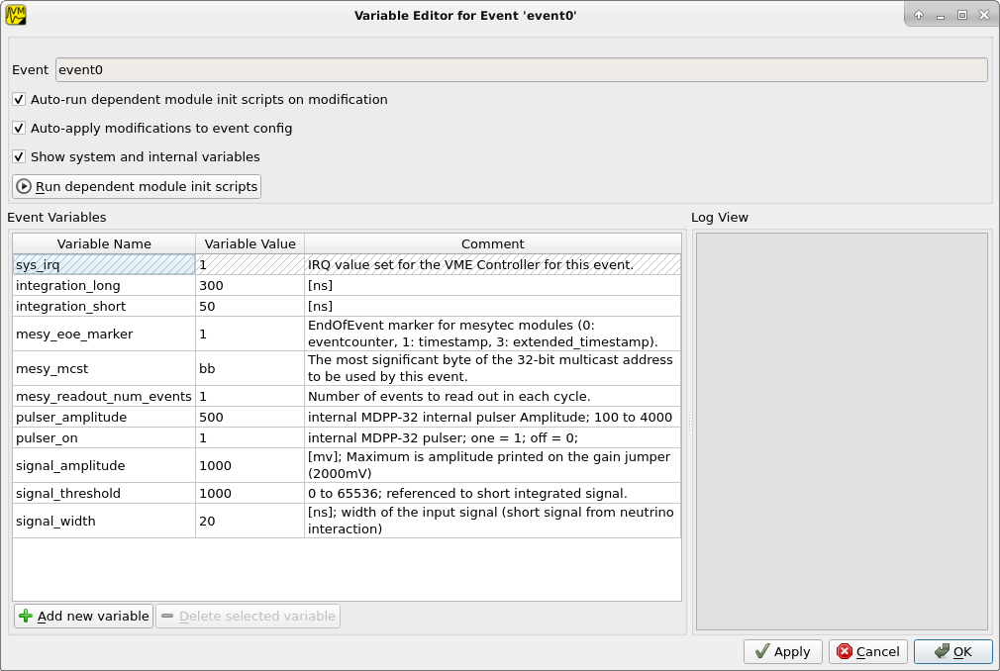
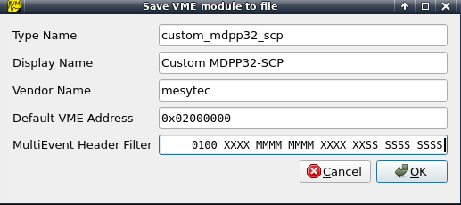

.. highlight:: none
.. index:: VME Config, VMEConfig, VME Tree
.. _vme-config-reference:

==================================================
VME configuration
==================================================

Structure
---------

The VME configuration in mvme models the logical VME setup. *Modules* that
should be read out as a result of the same trigger condition are grouped
together in an *Event*: ::

    Event0
        Module0.0
        Module0.1
        ...

    Event1
        Module1.0
        Module1.1
        ...

The type of available trigger conditions depends on the VME controller in use.
With the WIENER VM-USB the following triggers are available:

* NIM

  One external NIM input

* IRQ1-7

  The standard VME interrupts

* Periodic

  VM-USB supports one periodic trigger which is executed every ``n * 0.5s``
  (*Period*) or on every ``m-th`` data event (*Frequency*). If both values are
  set both internal counters are reset on each activation of the trigger. Refer
  to section 3.4.3 of the VM-USB manual for details.

Module and Event configuration
------------------------------

The module and event configuration is done using :ref:`VME scripts
<vme-script-reference>` which contain the commands necessary to initialize and
readout each module.

At the module level the following phases are defined:

* Reset

  Reset the module to a clean default state.

* Init

  Setup the module by writing specific registers.

* Readout

  The code needed to readout the module whenever the trigger condition fires.

The event level distinguishes between the following phases:

* Readout Cycle Start / End

  Inserted before / after the readout commands of the modules belonging to this
  event. The *Cycle Start* script is currently empty by default, the *Cycle
  End* script notifies the modules that readout has been performed. By default
  this is done by writing to the multicast address used for the event.

* DAQ Start / Stop

  Executed at the beginning / end of the a DAQ run. The purpose of the *DAQ
  Start* script is to reset module counters and tell each module to start data
  acquisition. *DAQ End* is used to tell the modules stop data acquisition. By
  default both scripts again use the multicast address of the corresponding
  event.

Variables
~~~~~~~~~

Since mvme-0.9.7 both event and module configs can contain a set of variables
whose values can be used inside :ref:`VME scripts <vme-script-reference>`.

Variables from the event scope are available inside the event scripts and all
child module scripts. Variables defined at module scope are available to the
module init and readout scripts. Module variables override variables defined at
event scope.

When adding a new VME event a set of standard variables is created:

* sys_irq

  A system variable which is automatically set to the IRQ value used to trigger
  the event or 0 if the event is not IRQ triggered.

* mesy_mcst

  Contains the highest 8-bits of the VME multicast (MCST) address setup for the
  event. This is used to initialize the events member modules and to
  simultaneously write each of the modules *readout_reset* register at the end
  of each readout cycle.

* mesy_eoe_marker

  EndOfEvent marker for mesytec modules (register 0x6038).

* mesy_readout_num_events

  Number of events to read out from each module per readout cycle. This is used
  to set the values of the ``irq_fifo_threshold (0x601E)`` and
  ``max_transfer_data (0x601A)`` of mesytec module. By default
  ``irq_fifo_threshold`` is set to ``mesy_readout_num_events + 1``.

The default VME templates shipped with mvme assume that the above variables are
defined and contain valid values for mesytec modules.

In the GUI variables can be viewed, added and modified by editing the
respective object (**Edit Event Settings** for events, **Edit Module Settings**
for modules).

For event configs there is also a special variable editor available via the
**Edit Variables** action button or context menu entry. This editor allows to
edit variables during a DAQ run and automatically executes VME scripts that are
affected by changes to variable values.

   Event Variable Editor with system and custom variables

.. _vme-config-daq-start:

DAQ startup procedure
---------------------

* Reset and setup the VME controller
* Assemble readout code from configured Events

  For each Event do:

  * Add *Cycle Start* script
  * For each Module:

    * Add Module readout script
    * Add "Write EndMarker" command (0x87654321, not needed for the MVLC)

  * Add *Cycle End* script

* Upload the readout code to the controller and activate triggers
* Execute global *DAQ Start* scripts, including the MVLC Trigger/IO script
* Initialize Modules

  For each Event do:

    * For each Module do:

      * Run *Module Reset*
      * Run all *Module Init* scripts

    * Run the Events *Multicast DAQ Start* script

* Set the controller to autonomous DAQ mode

Control is handed to the VME controller. mvme is now reading and
interpreting data returned from the controller.

.. _vme-config-daq-stop:

DAQ stop procedure
------------------

* Tell the VME controller to leave autonomous DAQ mode
* Read leftover data from the VME controller
* Run the *DAQ Stop* script for each Event
* Execute global *DAQ Stop* scripts

VME Controller specifics
------------------------

Mesytec MVLC
~~~~~~~~~~~~
To implement periodic events on the MVLC the global :ref:`MVLC Trigger/IO
<mvlc-trigger-io>` script is modified by mvme when starting a DAQ run: A
:ref:`StackStart <mvlc-trigger-io-StackStart>` unit is connected to a
:ref:`mvlc-trigger-io-Timer` unit which is setup with the parameters from the
corresponding periodic event. The StackStart unit is then setup to start the
command stack for the respective event. These changes are visible in the MVLC
Trigger/IO gui immediately after starting the DAQ.

SIS3153
~~~~~~~

If using the SIS3153 VME controller additional commands which activate Lemo
OUT2 during execution of the readout will be added to the script for the main
readout event. The main event is considered to be the first non-periodic event
defined in the VME configuration.

OUT1 and LED_A are activated prior to entering autonomous DAQ mode and
deactivated after leaving DAQ mode.

Custom VME Modules
------------------

To create a template for a custom VME module start by adding an existing module
type to the VME config as a base to start from (e.g. one of the UserModule_xx
modules). Then edit the VME scripts and test the module until initialization
and readout work correctly.

To save the module as a template right-click the module node and select ``Save
Module to file``.

   Custom Module properties dialog

The dialog lets you specify the following module properties:

* Type Name: internal module indentifier. Must be unique across all modules
  defined in mvme. Also used as the base name for newly added module instances.

  E.g. ``mdpp16_scp_custom``

* Display Name: User visible module type string, e.g. ``MDPP16 SCP Custom``.

* Vendor Name: custom vendor name. Used to group modules together in the UI.

* Default VME Address: the full 32-bit VME address assigned to newly added
  instance of the module, e.g ``0x00010000``

* MultiEvent Header Filter: in case the module supports reading out multiple
  buffered events using a single VME block transfer this property specifies the
  bit level filter used to split the mulievent data into separate events.  Set
  a static bitmask to match the module headers and optionally use the character
  ``S`` to specify the bits used to extract the module data size in words.
  Setting the size bits speeds up the multievent splitting code a bit as it can
  jump from event to event instead of having to match each data word against
  the static bitmask.

Accept the dialog and chose a location and filename to save the file. The
module file format is JSON so it can be hand-edited if needed.

To add an instance of a custom module to the VME config right-click an event
node or the ``Modules Init`` node and select ``Add Module from file``.
